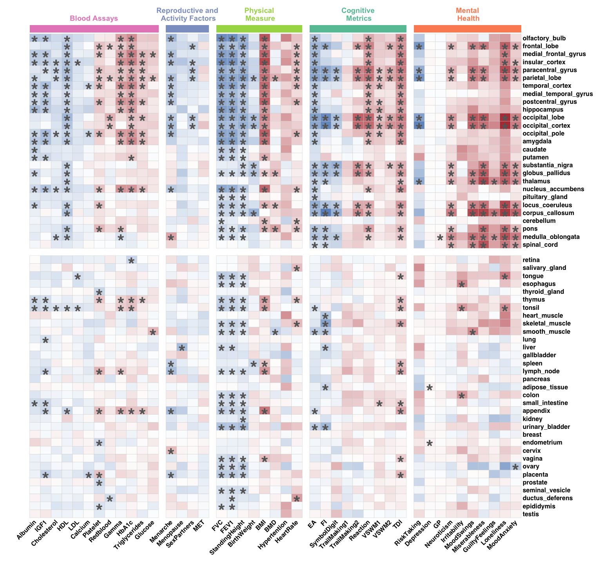
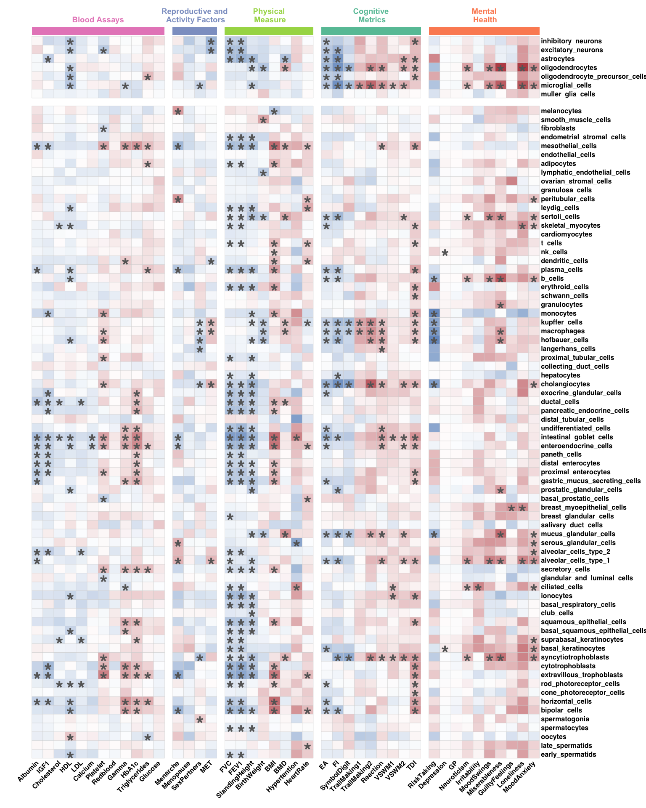
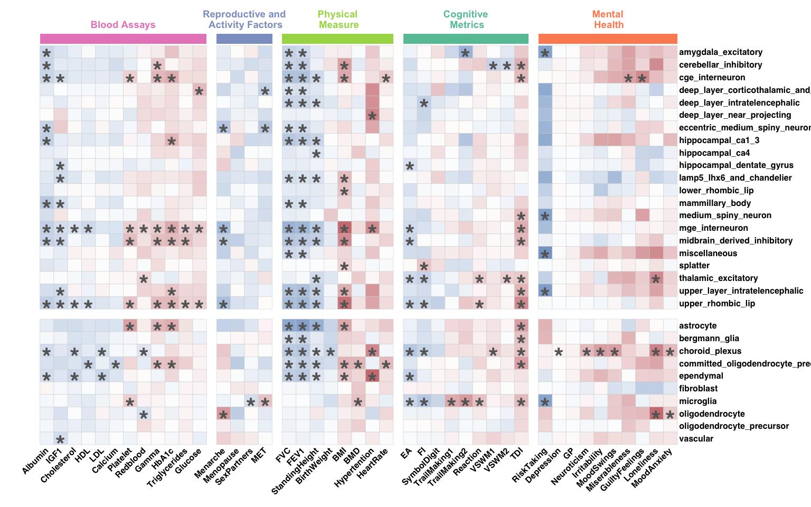
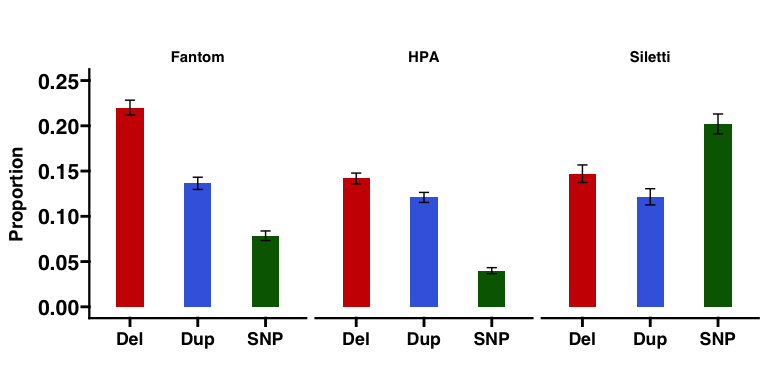
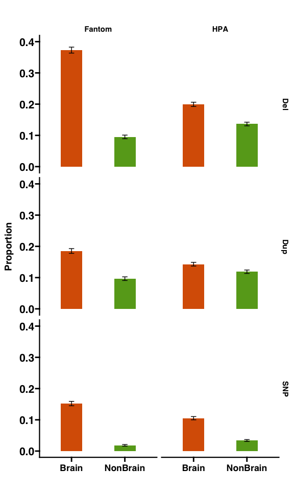
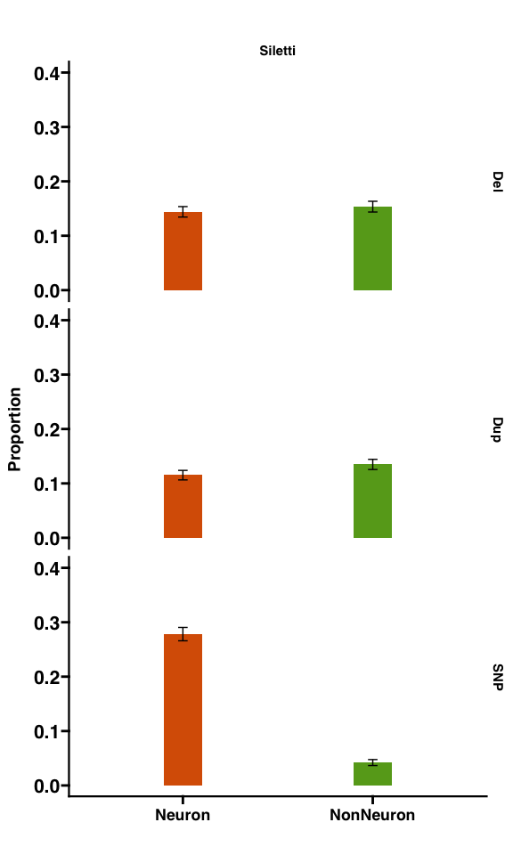

Fig2
================

## Fig. 2: Heatmap of effect sizes for whole body tissue, cell type gene sets across traits (& Figure S2,S3 & ST6-ST9 )

#### – Figure legend –

Legend: Heatmap displays a representative set of the most significant
associations between 5 categories of traits and deletions and
duplications aggregated across (A) tissues and (B) whole body cell
types. Traits are categorized and shown along the x-axis, while the
y-axis lists gene sets, tissues, and cell types. The blue and red
intensity color scale reflects the negative and positive effect sizes.
Black asterisks indicate statistically significant associations between
traits and genes (FDR correction across 172 ✕ 43 ✕ 2 =14,792 tests).
C-F) Bar plots (with standard error) summarizing the differences in the
level of association/enrichments between the type of variants for C, E)
all gene-sets, and D, F) brain and non-brain functional gene sets. Black
asterisks (\*) indicate statistically significant proportion differences
(FDR-adjusted). Abbreviations: HDL: high-density lipoprotein; HbA1c:
glycated haemoglobin; BMD: bone mineral density; BMI: body mass index;
EA: educational attainment; FI: fluid intelligence; TDI: townsend
deprivation index; VSWM: visuospatial working memory; FVC: Forced vital
capacity; Del: deletion; Dup: duplication; SNP: single nucleotide
polymorphism.

#### Libraries

``` r
#### Libraries for Heatmap & Bar-Plots
library(ggplot2)
library(ggprism)
library(grid)
library(ggpubr)
library(gridExtra)
library(tidyr)
library(tibble)
library(dplyr)
```

    ## 
    ## Attaching package: 'dplyr'

    ## The following object is masked from 'package:gridExtra':
    ## 
    ##     combine

    ## The following objects are masked from 'package:stats':
    ## 
    ##     filter, lag

    ## The following objects are masked from 'package:base':
    ## 
    ##     intersect, setdiff, setequal, union

``` r
library(ComplexHeatmap)
```

    ## ========================================
    ## ComplexHeatmap version 2.22.0
    ## Bioconductor page: http://bioconductor.org/packages/ComplexHeatmap/
    ## Github page: https://github.com/jokergoo/ComplexHeatmap
    ## Documentation: http://jokergoo.github.io/ComplexHeatmap-reference
    ## 
    ## If you use it in published research, please cite either one:
    ## - Gu, Z. Complex Heatmap Visualization. iMeta 2022.
    ## - Gu, Z. Complex heatmaps reveal patterns and correlations in multidimensional 
    ##     genomic data. Bioinformatics 2016.
    ## 
    ## 
    ## The new InteractiveComplexHeatmap package can directly export static 
    ## complex heatmaps into an interactive Shiny app with zero effort. Have a try!
    ## 
    ## This message can be suppressed by:
    ##   suppressPackageStartupMessages(library(ComplexHeatmap))
    ## ========================================

``` r
library(circlize)
```

    ## ========================================
    ## circlize version 0.4.16
    ## CRAN page: https://cran.r-project.org/package=circlize
    ## Github page: https://github.com/jokergoo/circlize
    ## Documentation: https://jokergoo.github.io/circlize_book/book/
    ## 
    ## If you use it in published research, please cite:
    ## Gu, Z. circlize implements and enhances circular visualization
    ##   in R. Bioinformatics 2014.
    ## 
    ## This message can be suppressed by:
    ##   suppressPackageStartupMessages(library(circlize))
    ## ========================================

#### FunBurd Associations’ output : effectsize, se & pvalue

``` r
load('ST2.RData')
tail(ST2)
```

    ##                Trait Trait_Cat           Geneset Geneset_Type Geneset_Cat
    ## 14787     Loneliness     Brain hippocampal_ca1_3 SC_Siletti31       Brain
    ## 14788   Irritability     Brain hippocampal_ca1_3 SC_Siletti31       Brain
    ## 14789  Miserableness     Brain hippocampal_ca1_3 SC_Siletti31       Brain
    ## 14790   Hypertention  NonBrain hippocampal_ca1_3 SC_Siletti31       Brain
    ## 14791 GuiltyFeelings     Brain hippocampal_ca1_3 SC_Siletti31       Brain
    ## 14792    MoodAnxiety     Brain hippocampal_ca1_3 SC_Siletti31       Brain
    ##       Geneset_SubCat CNV_Type   Effectsize        se    p_value FDR_p_value
    ## 14787         Neuron      DUP  0.059571182 0.0122729 0.01293087  0.07533194
    ## 14788         Neuron      DUP  0.006002351 0.0122729 0.78396546  0.90013329
    ## 14789         Neuron      DUP -0.004674945 0.0122729 0.81406575  0.91562544
    ## 14790         Neuron      DUP -0.020992736 0.0122729 0.35244341  0.60825375
    ## 14791         Neuron      DUP  0.005969737 0.0122729 0.78295700  0.89951269
    ## 14792         Neuron      DUP  0.007394190 0.0122729 0.47249904  0.71209432

#### Whole Body Tissue Level (Fantom) - Heatmap of the effectsizes + FDR-pvalues

``` r
## Tissue Level - Fantom (43*60) 
tissue_order <- c("olfactory_bulb", "frontal_lobe", "medial_frontal_gyrus", "insular_cortex",
                  "paracentral_gyrus", "parietal_lobe", "temporal_cortex", "medial_temporal_gyrus", "postcentral_gyrus",
                  "hippocampus", "occipital_lobe", "occipital_cortex", "occipital_pole",
                  "amygdala", "caudate", "putamen", "substantia_nigra", "globus_pallidus", "thalamus",
                  "nucleus_accumbens", "pituitary_gland", "locus_coeruleus", "corpus_callosum",
                  "cerebellum", "pons", "medulla_oblongata", "spinal_cord", "retina",
                  "salivary_gland", "tongue", "esophagus", "thyroid_gland", "thymus",
                  "tonsil", "heart_muscle", "skeletal_muscle", "smooth_muscle", "lung", "liver", "gallbladder",
                  "spleen", "lymph_node", "pancreas", "adipose_tissue", "colon", "small_intestine",
                  "appendix", "kidney", "urinary_bladder",
                  "breast", "endometrium", "cervix", "vagina", "ovary", "placenta", "prostate", "seminal_vesicle",
                  "ductus_deferens", "epididymis", "testis")

trait_order <- c('Albumin', 'IGF1', 'Cholesterol', 'HDL', 'LDL',
                    'Calcium', 'Platelet', 'Redblood', 'Gamma', 'HbA1c', 'Triglycerides', 'Glucose',
                    'Menarche', 'Menopause', 'SexPartners', 'MET',
                    'FVC', 'FEV1', 'StandingHeight', 'BirthWeight', 'BMI', 'BMD', 'Hypertention', 'HeartRate',
                    'EA', 'FI', 'SymbolDigit', 'TrailMaking1', 'TrailMaking2', 'Reaction', 'VSWM1', 'VSWM2', 'TDI',
                    'RiskTaking', 'Depression', 'GP', 'Neuroticism', 'Irritability', 'MoodSwings', 'Miserableness', 'GuiltyFeelings', 'Loneliness','MoodAnxiety')


### Subset the data  #####
df_FantomTissue=subset(ST2,Geneset_Type=='Tissue_Fantom60')
df_FantomTissue_Del=subset(df_FantomTissue,CNV_Type=='DEL')
df_FantomTissue_Del_EffectSize=subset(df_FantomTissue_Del,select=c('Trait','Geneset','Effectsize'))
df_FantomTissue_Del_fdrpval=subset(df_FantomTissue_Del,select=c('Trait','Geneset','FDR_p_value'))
# Effectsize matrix
Matrix_FantomTissue_Del_EffectSize <- df_FantomTissue_Del_EffectSize %>%
  pivot_wider(names_from = Trait, values_from = Effectsize) %>%
  column_to_rownames("Geneset")

# FDR p-value matrix
Matrix_FantomTissue_Del_fdrpval <- df_FantomTissue_Del_fdrpval %>%
  pivot_wider(names_from = Trait, values_from = FDR_p_value) %>%
  column_to_rownames("Geneset")

# Order rows and columns for Del matrix
order_index <- match(rownames(Matrix_FantomTissue_Del_EffectSize), tissue_order)
Matrix_FantomTissue_Del_EffectSize_ordered <- Matrix_FantomTissue_Del_EffectSize[order(order_index), ]
Matrix_FantomTissue_Del_EffectSize_ordered <- Matrix_FantomTissue_Del_EffectSize_ordered[, match(trait_order, colnames(Matrix_FantomTissue_Del_EffectSize_ordered))]

# Order rows and columns for p-values
order_index <- match(rownames(Matrix_FantomTissue_Del_fdrpval), tissue_order)
Matrix_FantomTissue_Del_fdrpval_ordered <- Matrix_FantomTissue_Del_fdrpval[order(order_index), ]
Matrix_FantomTissue_Del_fdrpval_ordered <- Matrix_FantomTissue_Del_fdrpval_ordered[, match(trait_order, colnames(Matrix_FantomTissue_Del_fdrpval_ordered))]
Matrix_FantomTissue_Del_fdrpval_ordered <- ifelse(Matrix_FantomTissue_Del_fdrpval_ordered < 0.05, "*", "")

# View matrices
print(Matrix_FantomTissue_Del_EffectSize_ordered[1:5,40:43])
```

    ##                      Miserableness GuiltyFeelings Loneliness MoodAnxiety
    ## olfactory_bulb         -0.01345800     0.05997481 0.06774048  0.02171000
    ## frontal_lobe            0.09331868     0.05372998 0.11323491  0.05452317
    ## medial_frontal_gyrus    0.01747809     0.04130576 0.09337945  0.03250781
    ## insular_cortex          0.02195888     0.05231306 0.09615180  0.04080584
    ## paracentral_gyrus       0.08331562     0.04424621 0.12924699  0.06514958

``` r
# Heatmap settings
colors <- colorRampPalette(c("#386cb0", "white", "#a50f15"))(100)
min_val <- -0.2
num_colors <- length(colors)
breaks <- seq(min_val, -min_val, length.out = num_colors)
color_function <- colorRamp2(breaks, colors)

# Create row annotations
row_annotation <- data.frame(
  Tissue = c(rep("Brain", 27), rep("Non-Brain", (60-27)))
)

row_annotation$Tissue <- factor(row_annotation$Tissue, levels = c("Brain", "Non-Brain"))

# Create column annotations
column_annotation <- data.frame(
  Trait = c(rep("Blood Assays",12),rep("Reproductive and\n Activity Factors",4),rep("Physical\n Measure",8),rep("Cognitive\n Metrics",9),rep("Mental\n Health",10))
)

column_annotation$Trait <- factor(column_annotation$Trait, levels = c("Blood Assays", "Reproductive and\n Activity Factors", "Physical\n Measure", "Cognitive\n Metrics", "Mental\n Health"))

# Define column heatmap annotation
column_ha <- HeatmapAnnotation(
  Trait = column_annotation$Trait,
  col = list(Trait = c("Blood Assays" = "#e78ac3", "Reproductive and\n Activity Factors" = "#8da0cb", "Physical\n Measure" = "#a6d854", "Cognitive\n Metrics" = "#66c2a5", "Mental\n Health" = "#fc8d62")),
  annotation_name = NULL,  # Remove both 'Supercluster' and 'Trait' labels
  show_legend = FALSE,
  show_annotation_name = FALSE
)

#png("Heatmap_DEL_Fantom_FDR.png",  width = 20000 , height = 25000,res = 1600 )
# Create the heatmap without dendrograms
ht1 <- Heatmap(
  as.matrix(Matrix_FantomTissue_Del_EffectSize_ordered), name = "Effect size",
  cluster_rows = FALSE,  # Disable row clustering
  cluster_columns = FALSE,  # Disable column clustering
  show_row_dend = FALSE,  # Do not show row dendrogram
  show_column_dend = FALSE,  # Do not show column dendrogram
  top_annotation = column_ha,
  row_split = row_annotation$Tissue,  # Split rows into 2 groups
  column_split = column_annotation$Trait,  # Split columns into 5 groups
  row_title = NULL,
  row_title_gp = gpar(fontsize = 8, fontface = "bold", fontfamily = "sans"),
  row_names_gp = gpar(col = "black", fontsize = 12, fontfamily = "sans", fontface = "bold"),
  column_title_gp = gpar(col = c('#e78ac3', '#8da0cb', '#a6d854', '#66c2a5', '#fc8d62'), fontsize = 14, fontface = "bold"),
  column_names_gp = gpar(col = "black", fontsize = 12, rot = 45, fontfamily = "sans", fontface = "bold"),
  column_names_rot = 45,
  cell_fun = function(j, i, x, y, width, height, fill) {
    grid.text(Matrix_FantomTissue_Del_fdrpval_ordered[i, j], x = x, y = y - convertHeight(grobHeight(textGrob('*')), "mm"), gp = gpar(fontsize = 36, col = 'grey40', fontfamily = "sans", just = "center", fontface = "bold",hjust=30))
  },
  col = color_function, row_gap = unit(0.5, "cm"),  # Adjust row margin (increase or decrease as needed)
  column_gap = unit(0.5, "cm"),
  show_heatmap_legend = FALSE,
  rect_gp = gpar(col = "lightgrey", lwd = 0.5)
)

#draw(ht1, padding = unit(c(0.5, 2, 0.5, 0.5), "cm"))
#dev.off()


# Draw the heatmap with padding
draw(ht1, padding = unit(c(0.5, 2, 0.5, 0.5), "cm"))
```

<!-- -->

#### Whole Body Cell Type Level (HPA) - Heatmap of the effectsizes + FDR-pvalues

``` r
## Cell Type Level - HPA (43*81) 
cell_order <- c("inhibitory_neurons", "excitatory_neurons", "astrocytes", "oligodendrocytes", "oligodendrocyte_precursor_cells", "microglial_cells",
                "muller_glia_cells", "melanocytes", "smooth_muscle_cells", "fibroblasts", "endometrial_stromal_cells", "mesothelial_cells",
                "endothelial_cells", "adipocytes", "lymphatic_endothelial_cells", "ovarian_stromal_cells", "granulosa_cells",
                "peritubular_cells", "leydig_cells", "sertoli_cells", "skeletal_myocytes", "cardiomyocytes", "t_cells", "nk_cells",
                "dendritic_cells", "plasma_cells", "b_cells", "erythroid_cells", "schwann_cells", "granulocytes", "monocytes",
                "kupffer_cells", "macrophages", "hofbauer_cells", "langerhans_cells", "proximal_tubular_cells", "collecting_duct_cells",
                "hepatocytes", "cholangiocytes", "exocrine_glandular_cells", "ductal_cells", "pancreatic_endocrine_cells", "distal_tubular_cells",
                "undifferentiated_cells", "intestinal_goblet_cells", "enteroendocrine_cells", "paneth_cells", "distal_enterocytes",
                "proximal_enterocytes", "gastric_mucus_secreting_cells", "prostatic_glandular_cells", "basal_prostatic_cells",
                "breast_myoepithelial_cells", "breast_glandular_cells", "salivary_duct_cells", "mucus_glandular_cells",
                "serous_glandular_cells", "alveolar_cells_type_2", "alveolar_cells_type_1", "secretory_cells", "glandular_and_luminal_cells",
                "ciliated_cells", "ionocytes", "basal_respiratory_cells", "club_cells", "squamous_epithelial_cells", "basal_squamous_epithelial_cells",
                "suprabasal_keratinocytes", "basal_keratinocytes", "syncytiotrophoblasts", "cytotrophoblasts", "extravillous_trophoblasts",
                "rod_photoreceptor_cells", "cone_photoreceptor_cells", "horizontal_cells", "bipolar_cells", "spermatogonia", "spermatocytes",
                "oocytes", "late_spermatids", "early_spermatids")


### Subset the data  #####
df_HPACell=subset(ST2,Geneset_Type=='SC_HPA81')
df_HPACell_Del=subset(df_HPACell,CNV_Type=='DEL')
df_HPACell_Del_EffectSize=subset(df_HPACell_Del,select=c('Trait','Geneset','Effectsize'))
df_HPACell_Del_fdrpval=subset(df_HPACell_Del,select=c('Trait','Geneset','FDR_p_value'))
# Effectsize matrix
Matrix_HPACell_Del_EffectSize <- df_HPACell_Del_EffectSize %>%
  pivot_wider(names_from = Trait, values_from = Effectsize) %>%
  column_to_rownames("Geneset")

# FDR p-value matrix
Matrix_HPACell_Del_fdrpval <- df_HPACell_Del_fdrpval %>%
  pivot_wider(names_from = Trait, values_from = FDR_p_value) %>%
  column_to_rownames("Geneset")

# Order rows and columns for Del matrix
order_index <- match(rownames(Matrix_HPACell_Del_EffectSize), cell_order)
Matrix_HPACell_Del_EffectSize_ordered <- Matrix_HPACell_Del_EffectSize[order(order_index), ]
Matrix_HPACell_Del_EffectSize_ordered <- Matrix_HPACell_Del_EffectSize_ordered[, match(trait_order, colnames(Matrix_HPACell_Del_EffectSize_ordered))]

# Order rows and columns for p-values
order_index <- match(rownames(Matrix_HPACell_Del_fdrpval), cell_order)
Matrix_HPACell_Del_fdrpval_ordered <- Matrix_HPACell_Del_fdrpval[order(order_index), ]
Matrix_HPACell_Del_fdrpval_ordered <- Matrix_HPACell_Del_fdrpval_ordered[, match(trait_order, colnames(Matrix_HPACell_Del_fdrpval_ordered))]
Matrix_HPACell_Del_fdrpval_ordered <- ifelse(Matrix_HPACell_Del_fdrpval_ordered < 0.05, "*", "")

# View matrices
print(Matrix_HPACell_Del_EffectSize_ordered[1:5,40:43])
```

    ##                                 Miserableness GuiltyFeelings Loneliness
    ## inhibitory_neurons                -0.02973146    0.028074784 0.03725527
    ## excitatory_neurons                -0.01636993   -0.019316717 0.07118275
    ## astrocytes                        -0.01409702   -0.025731855 0.06833238
    ## oligodendrocytes                   0.14617836    0.032231309 0.14744992
    ## oligodendrocyte_precursor_cells    0.03882846    0.003055625 0.07415401
    ##                                 MoodAnxiety
    ## inhibitory_neurons               0.02524460
    ## excitatory_neurons               0.03571007
    ## astrocytes                       0.03127681
    ## oligodendrocytes                 0.07821232
    ## oligodendrocyte_precursor_cells  0.04503971

``` r
# Create row annotations
row_annotation <- data.frame(
  Cell = c(rep("Brain",7 ), rep("Non-Brain", (81-7)))
)

row_annotation$Cell <- factor(row_annotation$Cell, levels = c("Brain", "Non-Brain"))

# all other setting are similar to the last chunk ###

ht2 <- Heatmap(
  as.matrix(Matrix_HPACell_Del_EffectSize_ordered), name = "Effect size",
  cluster_rows = FALSE,  # Disable row clustering
  cluster_columns = FALSE,  # Disable column clustering
  show_row_dend = FALSE,  # Do not show row dendrogram
  show_column_dend = FALSE,  # Do not show column dendrogram
  top_annotation = column_ha,
  row_split = row_annotation$Cell,  # Split rows into 2 groups
  column_split = column_annotation$Trait,  # Split columns into 5 groups
  row_title = NULL,
  row_title_gp = gpar(fontsize = 8, fontface = "bold", fontfamily = "sans"),
  row_names_gp = gpar(col = "black", fontsize = 12, fontfamily = "sans", fontface = "bold"),
  column_title_gp = gpar(col = c('#e78ac3', '#8da0cb', '#a6d854', '#66c2a5', '#fc8d62'), fontsize = 14, fontface = "bold"),
  column_names_gp = gpar(col = "black", fontsize = 12, rot = 45, fontfamily = "sans", fontface = "bold"),
  column_names_rot = 45,
  cell_fun = function(j, i, x, y, width, height, fill) {
    grid.text(Matrix_HPACell_Del_fdrpval_ordered[i, j], x = x, y = y - convertHeight(grobHeight(textGrob('*')), "mm"), gp = gpar(fontsize = 36, col = 'grey40', fontfamily = "sans", just = "center", fontface = "bold",hjust=30))
  },
  col = color_function, row_gap = unit(0.5, "cm"),  # Adjust row margin (increase or decrease as needed)
  column_gap = unit(0.5, "cm"),
  show_heatmap_legend = FALSE,
  rect_gp = gpar(col = "lightgrey", lwd = 0.5)
)
# Draw the heatmap with padding
draw(ht2, padding = unit(c(0.5, 2, 0.5, 0.5), "cm"))
```

<!-- -->

#### Whole Brain Cell Type Level (Siletti) - Heatmap of the effectsizes + FDR-pvalues

``` r
braincell_order = c(
     "amygdala_excitatory","cerebellar_inhibitory","cge_interneuron",               
     "deep_layer_corticothalamic_and_6b" ,"deep_layer_intratelencephalic","deep_layer_near_projecting",     
     "eccentric_medium_spiny_neuron","hippocampal_ca1_3","hippocampal_ca4", "hippocampal_dentate_gyrus",
     "lamp5_lhx6_and_chandelier","lower_rhombic_lip", "mammillary_body","medium_spiny_neuron","mge_interneuron",             
     "midbrain_derived_inhibitory","miscellaneous","splatter","thalamic_excitatory","upper_layer_intratelencephalic",
     "upper_rhombic_lip","astrocyte", "bergmann_glia", "choroid_plexus","committed_oligodendrocyte_precursor", "ependymal",
     "fibroblast","microglia","oligodendrocyte", "oligodendrocyte_precursor", "vascular"
  )

### Subset the data  #####
df_SilettiCell=subset(ST2,Geneset_Type=='SC_Siletti31')
df_SilettiCell_Del=subset(df_SilettiCell,CNV_Type=='DEL')
df_SilettiCell_Del_EffectSize=subset(df_SilettiCell_Del,select=c('Trait','Geneset','Effectsize'))
df_SilettiCell_Del_fdrpval=subset(df_SilettiCell_Del,select=c('Trait','Geneset','FDR_p_value'))
# Effectsize matrix
Matrix_SilettiCell_Del_EffectSize <- df_SilettiCell_Del_EffectSize %>%
  pivot_wider(names_from = Trait, values_from = Effectsize) %>%
  column_to_rownames("Geneset")

# FDR p-value matrix
Matrix_SilettiCell_Del_fdrpval <- df_SilettiCell_Del_fdrpval %>%
  pivot_wider(names_from = Trait, values_from = FDR_p_value) %>%
  column_to_rownames("Geneset")


# Order rows and columns for Del matrix
order_index <- match(rownames(Matrix_SilettiCell_Del_EffectSize), braincell_order)
Matrix_SilettiCell_Del_EffectSize_ordered <- Matrix_SilettiCell_Del_EffectSize[order(order_index), ]
Matrix_SilettiCell_Del_EffectSize_ordered <- Matrix_SilettiCell_Del_EffectSize_ordered[, match(trait_order, colnames(Matrix_SilettiCell_Del_EffectSize_ordered))]

# Order rows and columns for p-values
order_index <- match(rownames(Matrix_SilettiCell_Del_fdrpval), braincell_order)
Matrix_SilettiCell_Del_fdrpval_ordered <- Matrix_SilettiCell_Del_fdrpval[order(order_index), ]
Matrix_SilettiCell_Del_fdrpval_ordered <- Matrix_SilettiCell_Del_fdrpval_ordered[, match(trait_order, colnames(Matrix_SilettiCell_Del_fdrpval_ordered))]
Matrix_SilettiCell_Del_fdrpval_ordered <- ifelse(Matrix_SilettiCell_Del_fdrpval_ordered < 0.05, "*", "")

# View matrices
print(Matrix_SilettiCell_Del_EffectSize_ordered[1:5,40:43])
```

    ##                                   Miserableness GuiltyFeelings   Loneliness
    ## amygdala_excitatory                  0.06310371     0.03567376  0.044274445
    ## cerebellar_inhibitory                0.06201002     0.02777372  0.080179139
    ## cge_interneuron                      0.06382002     0.08153069  0.043775549
    ## deep_layer_corticothalamic_and_6b    0.01470983    -0.01693852 -0.047436867
    ## deep_layer_intratelencephalic        0.03617951    -0.01373321 -0.002349454
    ##                                    MoodAnxiety
    ## amygdala_excitatory                0.031638722
    ## cerebellar_inhibitory              0.026086898
    ## cge_interneuron                    0.023739318
    ## deep_layer_corticothalamic_and_6b -0.003268729
    ## deep_layer_intratelencephalic      0.013840890

``` r
row_annotation <- data.frame(
  braincell = c(rep("Neuron", 21), rep("Non-Neuron", 10))
)

row_annotation$braincell <- factor(row_annotation$braincell, levels = c("Neuron", "Non-Neuron"))

# all other setting are similar to the last chunk ###

ht3 <- Heatmap(
  as.matrix(Matrix_SilettiCell_Del_EffectSize_ordered), name = "Effect size",
  cluster_rows = FALSE,  # Disable row clustering
  cluster_columns = FALSE,  # Disable column clustering
  show_row_dend = FALSE,  # Do not show row dendrogram
  show_column_dend = FALSE,  # Do not show column dendrogram
  top_annotation = column_ha,
  row_split = row_annotation$braincell,  # Split rows into 2 groups
  column_split = column_annotation$Trait,  # Split columns into 5 groups
  row_title = NULL,
  row_title_gp = gpar(fontsize = 8, fontface = "bold", fontfamily = "sans"),
  row_names_gp = gpar(col = "black", fontsize = 12, fontfamily = "sans", fontface = "bold"),
  column_title_gp = gpar(col = c('#e78ac3', '#8da0cb', '#a6d854', '#66c2a5', '#fc8d62'), fontsize = 14, fontface = "bold"),
  column_names_gp = gpar(col = "black", fontsize = 12, rot = 45, fontfamily = "sans", fontface = "bold"),
  column_names_rot = 45,
  cell_fun = function(j, i, x, y, width, height, fill) {
    grid.text(Matrix_SilettiCell_Del_fdrpval_ordered[i, j], x = x, y = y - convertHeight(grobHeight(textGrob('*')), "mm"), gp = gpar(fontsize = 36, col = 'grey40', fontfamily = "sans", just = "center", fontface = "bold",hjust=30))
  },
  col = color_function, row_gap = unit(0.5, "cm"),  # Adjust row margin (increase or decrease as needed)
  column_gap = unit(0.5, "cm"),
  show_heatmap_legend = FALSE,
  rect_gp = gpar(col = "lightgrey", lwd = 0.5)
)
# Draw the heatmap with padding
draw(ht3, padding = unit(c(0.5, 2, 0.5, 0.5), "cm"))
```

<!-- -->

#### For Dup the same script is used.

#### Global Proportion Test For Del, Dup & GWAS(S-LDSC)

``` r
load('ST8.RData')
head(ST8)
```

    ##   Geneset_Type Type1 Type2      p_value  statistic estimate_prop_Type1
    ## 1       Fantom   SNP   Del 2.900000e-42 185.602972          0.07850877
    ## 2       Fantom   SNP   Dup 1.420000e-10  41.136684          0.07850877
    ## 3       Fantom   Del   Dup 5.300000e-15  61.146688          0.22015504
    ## 4          HPA   SNP   Del 6.180000e-45 197.840003          0.03996101
    ## 5          HPA   SNP   Dup 3.220000e-32 139.619410          0.03996101
    ## 6          HPA   Del   Dup 1.065306e-02   6.522292          0.14183175
    ##   estimate_prop_Type2 p_value_fdr
    ## 1           0.2201550 1.30000e-41
    ## 2           0.1364341 2.56000e-10
    ## 3           0.1364341 1.19000e-14
    ## 4           0.1418318 5.56000e-44
    ## 5           0.1208728 9.67000e-32
    ## 6           0.1208728 1.19847e-02

``` r
# Reshape data: gather proportions for both Type1 and Type2
Global_Prop <- ST8 %>%
  pivot_longer(cols = starts_with("estimate_prop"),
               names_to = "Type_source", values_to = "prop") %>%
  mutate(Type = ifelse(Type_source == "estimate_prop_Type1", Type1, Type2)) %>%
  select(Geneset_Type, Type, prop) %>%
  distinct()   # avoid duplicates

# Add n depending on Geneset_Type (for computing se of the proportion)
Global_Prop <- Global_Prop %>%
  mutate(n = case_when(
    Geneset_Type == "Fantom"  ~ 60*43,
    Geneset_Type == "HPA"     ~ 81*43,
    Geneset_Type == "Siletti" ~ 31*43
  )) %>%
  mutate(se = sqrt(prop * (1 - prop) / n))

# Custom colors
custom_colors <- c("SNP" = "darkgreen", "Del" = "red3", "Dup" = "royalblue")
# Plot
ggplot(Global_Prop, aes(x = Type, y = prop, fill = Type)) +
  geom_bar(stat = "identity", width = 0.4) +
  geom_errorbar(aes(ymin = prop - se, ymax = prop + se), width = 0.15) +
  scale_fill_manual(values = custom_colors) +
  labs(title = " ",
       y = "Proportion", x = " ") +
  ylim(0, 0.25) +
  facet_wrap(~Geneset_Type, nrow = 1) +
  theme_prism(base_size = 14) +
  theme(legend.position = "none",
        axis.line = element_line(linewidth = 0.8),
        axis.text.y = element_text(size = 16))
```

<!-- -->

``` r
print(subset(ST8,select=c('Geneset_Type', 'Type1', 'Type2', 'p_value_fdr')))
```

    ##   Geneset_Type Type1 Type2  p_value_fdr
    ## 1       Fantom   SNP   Del 1.300000e-41
    ## 2       Fantom   SNP   Dup 2.560000e-10
    ## 3       Fantom   Del   Dup 1.190000e-14
    ## 4          HPA   SNP   Del 5.560000e-44
    ## 5          HPA   SNP   Dup 9.670000e-32
    ## 6          HPA   Del   Dup 1.198470e-02
    ## 7      Siletti   SNP   Del 4.338460e-04
    ## 8      Siletti   SNP   Dup 7.700000e-08
    ## 9      Siletti   Del   Dup 6.086205e-02

#### Brain-Nbrain Proportion Test For Del, Dup & GWAS(S-LDSC)

``` r
load('ST9.RData')
head(ST9)
```

    ##   Type Geneset_Type      p_value   statistic estimate_prop_Brain
    ## 1  Del       Fantom 4.890000e-64 285.4459309           0.3729543
    ## 2  Del          HPA 3.668065e-03   8.4412379           0.1993355
    ## 3  Del      Siletti 7.067248e-01   0.1415704           0.1439646
    ## 4  Dup       Fantom 9.940000e-11  41.8323609           0.1851852
    ## 5  Dup          HPA 2.577819e-01   1.2806302           0.1428571
    ## 6  Dup      Siletti 3.472231e-01   0.8835796           0.1151717
    ##   estimate_prop_NonBrain  p_value_fdr
    ## 1             0.09513742 4.400000e-63
    ## 2             0.13639221 5.502097e-03
    ## 3             0.15348837 7.067248e-01
    ## 4             0.09654686 2.240000e-10
    ## 5             0.11879321 3.314339e-01
    ## 6             0.13488372 3.906260e-01

``` r
# Prepare data
BrainNbrainNeuronNonNeuron_Prop <- ST9 %>%
  pivot_longer(cols = starts_with("estimate_prop"),
               names_to = "BrainNbrain", values_to = "prop") %>%
  mutate(
    # Assign Brain/NonBrain labels
    BrainNbrain = ifelse(BrainNbrain == "estimate_prop_Brain", "Brain", "NonBrain")
  )

# Add n and compute SE
BrainNbrainNeuronNonNeuron_Prop <- BrainNbrainNeuronNonNeuron_Prop %>%
  mutate(n = case_when(
    Geneset_Type == "Fantom"  ~ 60*43,
    Geneset_Type == "HPA"     ~ 81*43,
    Geneset_Type == "Siletti" ~ 31*43
  )) %>%
  mutate(se = sqrt(prop * (1 - prop) / n))

# Custom colors
custom_colors <- c("Brain" = "#d95f02",
                   "NonBrain" = "#66a61e",
                   "Neuron" = "#d95f02",
                   "NonNeuron" = "#66a61e")

# --- Plot Fantom + HPA ---
BrainNbrain_Prop <- BrainNbrainNeuronNonNeuron_Prop %>% filter(Geneset_Type %in% c("Fantom", "HPA"))
ggplot(BrainNbrain_Prop, aes(x = BrainNbrain, y = prop, fill = BrainNbrain)) +
  geom_bar(stat = "identity", width = 0.4) +
  geom_errorbar(aes(ymin = prop - se, ymax = prop + se), width = 0.1) +
  scale_fill_manual(values = custom_colors) +
  labs(title = " ", y = "Proportion", x = "") +
  ylim(0, 0.4) +
  facet_grid(Type ~ Geneset_Type) +
  theme_prism(base_size = 14) +
  theme(
    legend.position = "none",
    axis.line = element_line(linewidth  = 0.8),
    axis.line.x = element_line(size = 0.8),
    axis.text.y = element_text(size = 16)
  )
```

    ## Warning: The `size` argument of `element_line()` is deprecated as of ggplot2 3.4.0.
    ## ℹ Please use the `linewidth` argument instead.
    ## This warning is displayed once every 8 hours.
    ## Call `lifecycle::last_lifecycle_warnings()` to see where this warning was
    ## generated.

<!-- -->

``` r
# --- Plot Siletti ---
NeuronNonNeuron_Prop <- BrainNbrainNeuronNonNeuron_Prop %>%
  filter(Geneset_Type == "Siletti") %>%
  mutate(NeuronNonNeuron = ifelse(BrainNbrain == "Brain", "Neuron", "NonNeuron"))

ggplot(NeuronNonNeuron_Prop, aes(x = NeuronNonNeuron, y = prop, fill = NeuronNonNeuron)) +
  geom_bar(stat = "identity", width = 0.2) +
  geom_errorbar(aes(ymin = prop - se, ymax = prop + se), width = 0.05) +
  scale_fill_manual(values = custom_colors) +
  labs(title = " ", y = "Proportion", x = " ") +
  ylim(0, 0.4) +
  facet_grid(Type ~ Geneset_Type) +
  theme_prism(base_size = 14) +
  theme(
    legend.position = "none",
    axis.line = element_line(linewidth = 0.8),
    axis.line.x = element_line(size = 0.8),
    axis.text.y = element_text(size = 16)
  )
```

<!-- -->

``` r
print(subset(ST9,select=c('Geneset_Type', 'Type', 'p_value_fdr')))
```

    ##   Geneset_Type Type  p_value_fdr
    ## 1       Fantom  Del 4.400000e-63
    ## 2          HPA  Del 5.502097e-03
    ## 3      Siletti  Del 7.067248e-01
    ## 4       Fantom  Dup 2.240000e-10
    ## 5          HPA  Dup 3.314339e-01
    ## 6      Siletti  Dup 3.906260e-01
    ## 7       Fantom  SNP 4.010000e-31
    ## 8          HPA  SNP 5.920000e-08
    ## 9      Siletti  SNP 2.480000e-20
