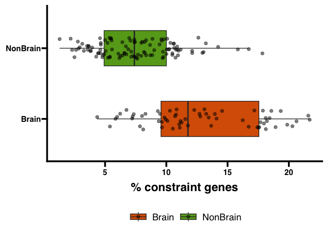
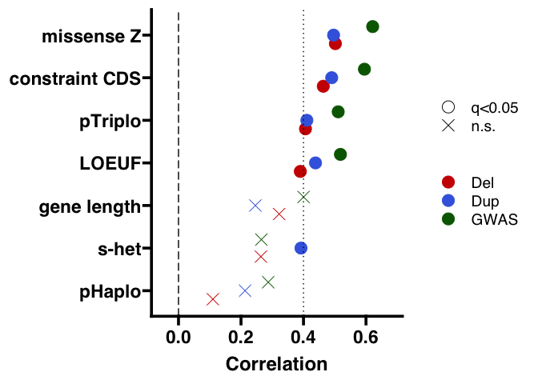
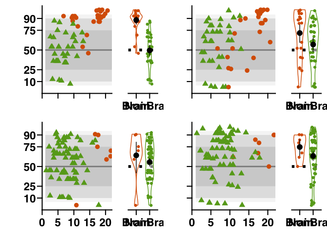

Fig3
================

## Fig. 3: Dissecting pleiotropy, gene function, and genetic constraint.

## Markdown for generating panel figures and statistics

## ——— Figure legend ———

Legend: A) Correlation between the fraction of constraint genes (LOEUF
top-decile) within a gene set and the number of traits showing
significant associations with that gene set for deletions and
duplications. Each data point is a gene set. Y-axis: the percentage of
significantly associated traits for a variant (functional pleiotropy);
X-axis: the percentage of top decile LOEUF genes within the gene set. B)
Box plots show the distribution of constraint gene percentages for all
Brain and Non-Brain gene sets (172). Each point represents a gene set,
and asterisks (\*) indicate statistically significant differences
between groups. C) Shows the same information on correlations in panel
(A) for different constraint metrics. D) Functional pleiotropy,
normalized by the fraction of genetic constraint at the tissue level, is
shown for 27 brain and 33 non-brain gene sets – deletions are presented
on the left and duplications on the right. X-axis: represents the
proportion of intolerant genes for the different gene sets. Y-axis:
functional pleiotropy normalized by genetic constraint (centile). I.e.,
the 50th centile shows median functional pleiotropy computed across 100
randomly sampled gene sets. Circles and triangles represent brain and
non-brain gene sets, respectively. Gray shaded ribbons indicating
25th–75th (ribbon 1), 10th–90th (ribbon 2), and 5th–95th (ribbon 3)
centiles. This is followed by violin plots showing the distribution of
normalized functional pleiotropy across brain and non-brain traits.
Orange and green asterisks demonstrate significantly (FDR-corrected, q
\< 0.05) increased functional pleiotropy compared to what is expected
for a gene set with a comparable fraction of genetic constraint. The
grey star shows a significant difference between the brain and non-brain
gene sets, normalized functional pleiotropy. E) The same analyses at the
whole-body cell type level, including 7 brain and 74 non-brain gene
sets.

## Fig 3 data

``` r
library(data.table)
library(tidyverse)
```

    ## ── Attaching core tidyverse packages ──────────────────────── tidyverse 2.0.0 ──
    ## ✔ dplyr     1.1.4     ✔ readr     2.1.5
    ## ✔ forcats   1.0.0     ✔ stringr   1.5.1
    ## ✔ ggplot2   3.5.2     ✔ tibble    3.3.0
    ## ✔ lubridate 1.9.4     ✔ tidyr     1.3.1
    ## ✔ purrr     1.1.0     
    ## ── Conflicts ────────────────────────────────────────── tidyverse_conflicts() ──
    ## ✖ dplyr::between()     masks data.table::between()
    ## ✖ dplyr::filter()      masks stats::filter()
    ## ✖ dplyr::first()       masks data.table::first()
    ## ✖ lubridate::hour()    masks data.table::hour()
    ## ✖ lubridate::isoweek() masks data.table::isoweek()
    ## ✖ dplyr::lag()         masks stats::lag()
    ## ✖ dplyr::last()        masks data.table::last()
    ## ✖ lubridate::mday()    masks data.table::mday()
    ## ✖ lubridate::minute()  masks data.table::minute()
    ## ✖ lubridate::month()   masks data.table::month()
    ## ✖ lubridate::quarter() masks data.table::quarter()
    ## ✖ lubridate::second()  masks data.table::second()
    ## ✖ purrr::transpose()   masks data.table::transpose()
    ## ✖ lubridate::wday()    masks data.table::wday()
    ## ✖ lubridate::week()    masks data.table::week()
    ## ✖ lubridate::yday()    masks data.table::yday()
    ## ✖ lubridate::year()    masks data.table::year()
    ## ℹ Use the conflicted package (<http://conflicted.r-lib.org/>) to force all conflicts to become errors

``` r
library(ggplot2)
library(ggprism)   # for theme
library(ggpubr)

### Parameters + Color code

brain_colorcode  ="#d95f02"      
nonbrain_colorcode = "#66a61e"  

in_base_size_ggprism = 18

## Load data
load(file = "Fig3_data_and_stats.RData")
df_fp_gsp_stacked_full = df_172geneset_properties_constraint_pleiotropy_normative_monotonic

### for centiles 3D-3E
load(file = paste0("Data_Fig3D_centiles_vs_constraint_normative.RData"))
```

## Fig3A: Correlation between constraint and Del/Dup/GWAS functional pleiotorpy

``` r
## Stats for correlation and pre-computed BrainSMASH p-value
df_stats_panel_A = df_brainsmash_results[which(df_brainsmash_results$constraint == "constraint_measure_LOEUF_topdecile"),c(1:4)]
df_stats_panel_A[,"adj_pvalue"] = p.adjust(df_stats_panel_A[,"pvalue_Jaccard"],method = "fdr")
print(df_stats_panel_A)
```

    ##                                    stat                         constraint
    ## 1        functional_pleiotropy_deletion constraint_measure_LOEUF_topdecile
    ## 8     functional_pleiotropy_duplication constraint_measure_LOEUF_topdecile
    ## 15 functional_pleiotropy_GWASenrichment constraint_measure_LOEUF_topdecile
    ##          cor pvalue_Jaccard adj_pvalue
    ## 1  0.3898868          0.012      0.018
    ## 8  0.4384765          0.001      0.003
    ## 15 0.5182434          0.026      0.026

``` r
## Scatter plot panel A
in_df_scatter = df_fp_gsp_stacked_full[,c("Geneset_Type","Geneset","functional_pleiotropy_deletion","functional_pleiotropy_duplication","functional_pleiotropy_GWASenrichment","constraint")]

#in_x_label = "fraction of genes in top-decile LOEUF"
in_x_label = "% constraint genes"
in_y_label = "% functional pleiotropy"

### change to percentage
in_df_scatter[,"constraint"] = 100*in_df_scatter[,"constraint"]

#-----------------------------------------------
## DEL

temp_cor <- cor(in_df_scatter[,"constraint"],in_df_scatter[,"functional_pleiotropy_deletion"])
if( df_stats_panel_A[1,"adj_pvalue"] < 0.05){
  temp_corr_label <- paste0("r=",round(temp_cor,2),"*")
} else {
  temp_corr_label <- paste0("r=",round(temp_cor,2))
}

p_scatter_del = ggplot(in_df_scatter,aes(x=constraint,y=functional_pleiotropy_deletion))+
  theme_prism(axis_text_angle = 90,base_size = in_base_size_ggprism )+
  geom_point(color="red3",size=3,alpha = 1) + 
  annotate("text",x=Inf,y=Inf,hjust=1,vjust=1,label=temp_corr_label,size=10)+
  geom_smooth(method = "lm",se=FALSE,linewidth=2,fullrange=TRUE,color = "black")+ 
  ylim(0,75)+xlab(in_x_label) + ylab(in_y_label)

#-------------------
## DUP

temp_cor <- cor(in_df_scatter[,"constraint"],in_df_scatter[,"functional_pleiotropy_duplication"])
if( df_stats_panel_A[2,"adj_pvalue"] < 0.05){
  temp_corr_label <- paste0("r=",round(temp_cor,2),"*")
} else {
  temp_corr_label <- paste0("r=",round(temp_cor,2))
}

p_scatter_dup = ggplot(in_df_scatter,aes(x=constraint,y=functional_pleiotropy_duplication))+
  theme_prism(axis_text_angle = 90,base_size = in_base_size_ggprism )+
  geom_point(color="royalblue",size=3,alpha = 1) + 
  annotate("text",x=Inf,y=Inf,hjust=1,vjust=1,label=temp_corr_label,size=10)+
  geom_smooth(method = "lm",se=FALSE,linewidth=2,fullrange=TRUE,color = "black")+ 
  ylim(0,75)+xlab(in_x_label) + ylab(in_y_label)

#----------
## GWAS
temp_cor <- cor(in_df_scatter[,"constraint"],in_df_scatter[,"functional_pleiotropy_GWASenrichment"])
if( df_stats_panel_A[3,"adj_pvalue"] < 0.05){
  temp_corr_label <- paste0("r=",round(temp_cor,2),"*")
} else {
  temp_corr_label <- paste0("r=",round(temp_cor,2))
}

p_scatter_gwas = ggplot(in_df_scatter,aes(x=constraint,y=functional_pleiotropy_GWASenrichment))+
  theme_prism(axis_text_angle = 90,base_size = in_base_size_ggprism)+
  geom_point(color="darkgreen",size=3,alpha = 1) + 
  annotate("text",x=Inf,y=Inf,hjust=1,vjust=1,label=temp_corr_label,size=10)+
  geom_smooth(method = "lm",se=FALSE,linewidth=2,fullrange=TRUE,color = "black")+  
  ylim(0,75)+xlab(in_x_label) + ylab(in_y_label)


## single stacked plot
p_scatter_Fig3A = ggarrange(p_scatter_del + xlab(" "),
                          p_scatter_dup + theme(axis.title.y=element_blank(),axis.text.y=element_blank(),axis.ticks.y =element_blank()),
                          p_scatter_gwas + xlab(" ") + theme(axis.title.y=element_blank(),axis.text.y=element_blank(),axis.ticks.y =element_blank()),
                          ncol = 3, nrow = 1,align = "h",
                          labels = c("Del","Dup","GWAS"),vjust =1,
                          widths = c(0.4,0.3,0.3),common.legend = TRUE) # +
```

    ## `geom_smooth()` using formula = 'y ~ x'
    ## `geom_smooth()` using formula = 'y ~ x'
    ## `geom_smooth()` using formula = 'y ~ x'
    ## `geom_smooth()` using formula = 'y ~ x'
    ## `geom_smooth()` using formula = 'y ~ x'
    ## `geom_smooth()` using formula = 'y ~ x'

``` r
                          #ggtitle("Fig 3A")

print(p_scatter_Fig3A)
```

<!-- -->

## Fig3B: : Boxplots for Brain and NonBrain geneset constraint scores

``` r
in_y_label = "% constraint genes"

## stats for Panel B
print(wilcox.test(df_fp_gsp_stacked_full[which(df_fp_gsp_stacked_full$Geneset_Cat == "Brain"),"constraint"],df_fp_gsp_stacked_full[which(df_fp_gsp_stacked_full$Geneset_Cat == "NonBrain"),"constraint"]))
```

    ## 
    ##  Wilcoxon rank sum test with continuity correction
    ## 
    ## data:  df_fp_gsp_stacked_full[which(df_fp_gsp_stacked_full$Geneset_Cat == "Brain"), "constraint"] and df_fp_gsp_stacked_full[which(df_fp_gsp_stacked_full$Geneset_Cat == "NonBrain"), "constraint"]
    ## W = 5623, p-value = 3.473e-12
    ## alternative hypothesis: true location shift is not equal to 0

``` r
### BoxPlot for Panel B

p_box = ggplot(df_fp_gsp_stacked_full, aes(x = Geneset_Cat, y = constraint, fill = Geneset_Cat)) +
  geom_boxplot(outlier.shape = NA, width = 0.5, alpha = 1) + 
  geom_jitter(width = 0.15, size = 2, alpha = 0.5) + 
  labs(x = NULL, y = in_y_label)+
  scale_fill_manual(values = c("Brain" = brain_colorcode, "NonBrain" = nonbrain_colorcode))+
  scale_x_discrete(labels = c("Brain" = "Brain", "NonBrain" = "NonBrain")) + # Manually set x-axis labels
  theme_prism(base_size = in_base_size_ggprism)+
  theme(legend.position = "bottom",
        axis.text.x = element_text(size = 12, face = "bold"),
        axis.text.y = element_text(size = 12, face = "bold"),
        plot.title = element_text(face = "bold", size = 14),
        strip.text = element_text(face = "bold"))+
  coord_flip() #+
  #ggtitle("Fig 3B")

print(p_box)
```

<!-- -->

## Fig3C: Constraint vs Functional pleiotropy for multiple constraint scores

``` r
array_constraint_set = c("constraint_measure_LOEUF_topdecile",    
                         "constraint_measure_missense_Z_topdecile",
                         "constraint_measure_s_het_topdecile",   
                         "constraint_measure_CDS_topdecile",       
                         "constraint_measure_pHaplo_topdecile",    
                         "constraint_measure_pTriplo_topdecile",  
                         "constraint_measure_GeneLenBP_topdecile")

array_label_names = c("LOEUF","missense Z","s-het","constraint CDS","pHaplo","pTriplo","gene length")


### Re-order pre-computed BrainSMASH corr, p_Jaccard, and p-Jaccard FDR
in_df_cor = data.frame(Del_Pleiotropy = df_brainsmash_results[c(1:7),"cor"],
                       Dup_Pleiotropy = df_brainsmash_results[c(8:14),"cor"],
                       GWAS_Pleiotropy = df_brainsmash_results[c(15:21),"cor"])

in_df_pval = data.frame(Del_Pleiotropy = df_brainsmash_results[c(1:7),"pvalue_Jaccard"],
                       Dup_Pleiotropy = df_brainsmash_results[c(8:14),"pvalue_Jaccard"],
                       GWAS_Pleiotropy = df_brainsmash_results[c(15:21),"pvalue_Jaccard"])

in_df_pvalAdj = data.frame(Del_Pleiotropy = df_brainsmash_results[c(1:7),"adj_pvalue_Jaccard"],
                        Dup_Pleiotropy = df_brainsmash_results[c(8:14),"adj_pvalue_Jaccard"],
                        GWAS_Pleiotropy = df_brainsmash_results[c(15:21),"adj_pvalue_Jaccard"])


in_df_plot =  data.frame( constraint = c(array_label_names,array_label_names,array_label_names),
                          type = c(rep("Del",length(array_label_names)),rep("Dup",length(array_label_names)),rep("GWAS",length(array_label_names))),
                          cor = c(in_df_cor[,"Del_Pleiotropy"],in_df_cor[,"Dup_Pleiotropy"],in_df_cor[,"GWAS_Pleiotropy"]),
                          pval = c(in_df_pval[,"Del_Pleiotropy"],in_df_pval[,"Dup_Pleiotropy"],in_df_pval[,"GWAS_Pleiotropy"]),
                          pval_adj = c(in_df_pvalAdj[,"Del_Pleiotropy"],in_df_pvalAdj[,"Dup_Pleiotropy"],in_df_pvalAdj[,"GWAS_Pleiotropy"]))


pval_thres = 0.05

# significance flag    
in_df_plot[,"sig"] = "n.s."
in_df_plot[which(in_df_plot[,"pval_adj"] < pval_thres),"sig"] = "q<0.05"

# level for type
in_df_plot[,"type"] = factor(in_df_plot[,"type"],levels = c("Del","Dup","GWAS"))
in_df_plot[,"sig"] = factor(in_df_plot[,"sig"],levels = c("q<0.05","n.s."))

# order constraint measures based on Del
array_constraint_levels = in_df_plot[order(in_df_plot[which(in_df_plot[,"type"] == "Del"),"cor"]),"constraint"]
in_df_plot[,"constraint"] = factor(in_df_plot[,"constraint"],levels = array_constraint_levels)

### Point plot
p_Fig3C = ggplot(data = in_df_plot, aes(y = constraint, x = cor, group = type)) +
  geom_point(aes(color = type, fill = type, shape=sig),size = 5,position=position_dodge(width = 0.6)) +
  scale_fill_manual(values = c("Del" = "red3", "Dup" = "royalblue", "GWAS" = "darkgreen")) +
  scale_color_manual(values = c("Del" = "red3", "Dup" = "royalblue", "GWAS" = "darkgreen")) +
  scale_shape_manual(values = c("q<0.05" = 21, "n.s." = 4)) +
  geom_vline(xintercept = 0,linetype="longdash", color="black")+
  geom_vline(xintercept = 0.4,linetype="dotted", color="black")+
  xlim(-0.05,0.68) + xlab("Correlation") + ylab(NULL)+
  theme(legend.position = c(0.85,0.2)) +
  theme_prism(base_size = in_base_size_ggprism) #+
  #ggtitle("Fig 3C")

print(p_Fig3C)
```

<!-- -->

## Plot Fig3D-3E: : normative null models based centile plots

``` r
array_Geneset_Type = c("Tissue_Fantom60","SC_HPA81") 

#---------
loop_cat = 1

# Subset for Tissue_Fantom60
in_df_plot = df_fp_gsp_stacked_full[df_fp_gsp_stacked_full[,"Geneset_Type"] == array_Geneset_Type[loop_cat],]

# Violin plot: Brain vs Non-Brain gene-sets
p1_del_box = ggplot(in_df_plot, aes(x = Geneset_Cat, y = normative_model_centile_del_pleiotropy,group=Geneset_Cat)) +
  ylim(0,101)+ 
  geom_hline(yintercept = 50,linetype="dotted", color="black",linewidth = 2)+
  geom_violin(aes(color=Geneset_Cat),alpha = 0.5,trim = TRUE) +
  geom_point(aes(color=Geneset_Cat),position = position_jitter(seed = 1, width = 0.2)) +
  stat_summary(color="black",fun.data="mean_cl_boot",geom = "pointrange",size = 0.7)+
  scale_color_manual(values = c("Brain" = brain_colorcode, "NonBrain" = nonbrain_colorcode)) +
  xlab(NULL) + ylab(NULL)+  
  scale_x_discrete(labels=c("Brain","NonBrain"))+
  theme_prism(base_size = in_base_size_ggprism,base_line_size = in_base_size_ggprism/24,base_rect_size = in_base_size_ggprism/24)+
  theme(legend.position = "none",axis.title.x = element_blank(),axis.text.x =element_text(angle = 0),
        axis.title.y = element_blank(),axis.line.y = element_blank(),axis.text.y =element_blank(),axis.ticks.y=element_blank()) 

#print(p1_del_box)

## DUP
# Violin plot: Brain vs Non-Brain gene-sets
p1_dup_box = ggplot(in_df_plot, aes(x = Geneset_Cat, y = normative_model_centile_dup_pleiotropy,color=Geneset_Cat)) +
  ylim(0,101)+ 
  geom_hline(yintercept = 50,linetype="dotted", color="black",linewidth = 2)+
  geom_violin(aes(color=Geneset_Cat),alpha = 0.5,trim = TRUE) +
  geom_point(aes(color=Geneset_Cat),position = position_jitter(seed = 1, width = 0.2)) +
  stat_summary(color="black",fun.data="mean_cl_boot",geom = "pointrange",size = 0.7)+
  scale_color_manual(values = c("Brain" = brain_colorcode, "NonBrain" = nonbrain_colorcode)) +
  xlab(NULL) + ylab(NULL)+  
  scale_x_discrete(labels=c("Brain","NonBrain"))+
  theme_prism(base_size = in_base_size_ggprism,base_line_size = in_base_size_ggprism/24,base_rect_size = in_base_size_ggprism/24)+
  theme(legend.position = "none",axis.title.x = element_blank(),axis.text.x =element_text(angle = 0),
        axis.title.y = element_blank(),axis.line.y = element_blank(),axis.text.y =element_blank(),axis.ticks.y=element_blank()) 

#print(p1_dup_box)


#--------- ## SC_HPA81
loop_cat = 2

# Subset for SC_HPA81
in_df_plot = df_fp_gsp_stacked_full[df_fp_gsp_stacked_full[,"Geneset_Type"] == array_Geneset_Type[loop_cat],]

# Violin plot: Brain vs Non-Brain gene-sets
p2_del_box = ggplot(in_df_plot, aes(x = Geneset_Cat, y = normative_model_centile_del_pleiotropy,color=Geneset_Cat)) +
  ylim(0,101)+ 
  geom_hline(yintercept = 50,linetype="dotted", color="black",linewidth = 2)+
  geom_violin(aes(color=Geneset_Cat),alpha = 0.5,trim = TRUE) +
  geom_point(aes(color=Geneset_Cat),position = position_jitter(seed = 1, width = 0.2)) +
  stat_summary(color="black",fun.data="mean_cl_boot",geom = "pointrange",size = 0.7)+
  scale_color_manual(values = c("Brain" = brain_colorcode, "NonBrain" = nonbrain_colorcode)) +
  xlab(NULL) + ylab(NULL)+  
  scale_x_discrete(labels=c("Brain","NonBrain"))+
  theme_prism(base_size = in_base_size_ggprism,base_line_size = in_base_size_ggprism/24,base_rect_size = in_base_size_ggprism/24)+
  theme(legend.position = "none",axis.title.x = element_blank(),axis.text.x =element_text(angle = 0),
        axis.title.y = element_blank(),axis.line.y = element_blank(),axis.text.y =element_blank(),axis.ticks.y=element_blank()) 

#print(p2_del_box)


## DUP
# make Violin plot: Brain vs Non-Brain gene-sets
p2_dup_box = ggplot(in_df_plot, aes(x = Geneset_Cat, y = normative_model_centile_dup_pleiotropy,color=Geneset_Cat)) +
  ylim(0,101)+ 
  geom_hline(yintercept = 50,linetype="dotted", color="black",linewidth = 2)+
  geom_violin(aes(color=Geneset_Cat),alpha = 0.5,trim = TRUE) +
  geom_point(aes(color=Geneset_Cat),position = position_jitter(seed = 1, width = 0.2)) +
  stat_summary(color="black",fun.data="mean_cl_boot",geom = "pointrange",size = 0.7)+
  scale_color_manual(values = c("Brain" = brain_colorcode, "NonBrain" = nonbrain_colorcode)) +
  xlab(NULL) + ylab(NULL)+  
  scale_x_discrete(labels=c("Brain","NonBrain"))+
  theme_prism(base_size = in_base_size_ggprism,base_line_size = in_base_size_ggprism/24,base_rect_size = in_base_size_ggprism/24)+
  theme(legend.position = "none",axis.title.x = element_blank(),axis.text.x =element_text(angle = 0),
        axis.title.y = element_blank(),axis.line.y = element_blank(),axis.text.y =element_blank(),axis.ticks.y=element_blank()) 

#print(p2_dup_box)

#------------------------------------------------------------------------------
# PART 2: Scatter-plots using Centiles

## data with centiles x % constraint genes (for plotting null ribbons)
data = data_fig3d_null_centiles 

colnames(data)
```

    ##  [1] "constraint"     "centile_5"      "centile_10"     "centile_25"    
    ##  [5] "centile_50"     "centile_75"     "centile_90"     "centile_95"    
    ##  [9] "mean_fp_upper1" "mean_fp_lower1" "mean_fp_upper2" "mean_fp_lower2"
    ## [13] "mean_fp_upper3" "mean_fp_lower3"

``` r
#-----------------------------------
##### 1. DEL

df_fp_gsp_stacked_full = df_172geneset_properties_constraint_pleiotropy_normative_monotonic

### 1. plot for Fantom
loop_cat = 1
# Subset for Fantom 
df2 = df_fp_gsp_stacked_full[df_fp_gsp_stacked_full[,"Geneset_Type"] == array_Geneset_Type[loop_cat],]

# Scatter plot: Centiles plot + add points for Gene-set
p1_del = ggplot(data, aes(x = constraint, y = centile_50)) +
  geom_line(color = "black",size=1) + 
  geom_ribbon(aes(ymin = mean_fp_lower1, ymax = mean_fp_upper1), fill = "grey80", alpha = 0.5) +
  geom_ribbon(aes(ymin = mean_fp_lower2, ymax = mean_fp_upper2), fill = "grey70", alpha = 0.3) +
  geom_ribbon(aes(ymin = mean_fp_lower3, ymax = mean_fp_upper3), fill = "grey60", alpha = 0.1) +
  geom_point(data = df2, aes(x = constraint, y = normative_model_centile_del_pleiotropy, color = Geneset_Cat, shape = Geneset_Cat),size=3) +
  scale_color_manual(values = c("Brain" = brain_colorcode, "NonBrain" =nonbrain_colorcode)) +
  scale_shape_manual(values = c("Brain" = 16, "NonBrain" = 17)) +
  xlab("% constraint genes") + ylab(paste("functional pleiotropy\n","normative centiles"))+  
  scale_x_continuous(expand = c(0, 0),limits = c(0,22),breaks = c(seq(0, 22, by = 5)),
                     labels = c(seq(0, 22, by = 5))) +
  scale_y_continuous(limits = c(0,101),breaks = c(10,25,50,75,90),
                     labels = c(10,25,50,75,90)) +
  theme_prism(base_size = in_base_size_ggprism,base_line_size = in_base_size_ggprism/24,base_rect_size = in_base_size_ggprism/24)+
  theme(legend.position = c(0.2,0.9))
#print(p1_del)

## 2. plot for  SC_HPA
loop_cat = 2
# Subset for SC_HPA81 
df2 = df_fp_gsp_stacked_full[df_fp_gsp_stacked_full[,"Geneset_Type"] == array_Geneset_Type[loop_cat],]
for(loop_c in c(5:ncol(df2))){
  df2[,loop_c] = as.numeric(df2[,loop_c])
}

# Scatter plot: Centiles plot + add points for Gene-set
p2_del = ggplot(data, aes(x = constraint, y = centile_50)) +
  geom_line(color = "black",size=1) +
  geom_ribbon(aes(ymin = mean_fp_lower1, ymax = mean_fp_upper1), fill = "grey80", alpha = 0.5) +
  geom_ribbon(aes(ymin = mean_fp_lower2, ymax = mean_fp_upper2), fill = "grey70", alpha = 0.3) +
  geom_ribbon(aes(ymin = mean_fp_lower3, ymax = mean_fp_upper3), fill = "grey60", alpha = 0.1) +
  geom_point(data = df2, aes(x = constraint, y = normative_model_centile_del_pleiotropy, color = Geneset_Cat, shape = Geneset_Cat),size=3) +
  scale_color_manual(values = c("Brain" = brain_colorcode, "NonBrain" =nonbrain_colorcode)) +
  scale_shape_manual(values = c("Brain" = 16, "NonBrain" = 17)) +
  xlab("% constraint genes") + ylab(paste("functional pleiotropy\n","normative centiles"))+  
  scale_x_continuous(expand = c(0, 0),limits = c(0,22),breaks = c(seq(0, 22, by = 5)),
                     labels = c(seq(0, 22, by = 5))) +
  scale_y_continuous(limits = c(0,101),breaks = c(10,25,50,75,90),
                     labels = c(10,25,50,75,90)) +
  theme_prism(base_size = in_base_size_ggprism,base_line_size = in_base_size_ggprism/24,base_rect_size = in_base_size_ggprism/24)+
  theme(legend.position = c(0.2,0.9))

#print(p2_del)

#-----------------------------------
## ##### 2. DUP

### 1. plot for Fantom
loop_cat = 1
# Subset for Fantom
df2 = df_fp_gsp_stacked_full[df_fp_gsp_stacked_full[,"Geneset_Type"] == array_Geneset_Type[loop_cat],]
for(loop_c in c(5:ncol(df2))){
  df2[,loop_c] = as.numeric(df2[,loop_c])
}

# Scatter plot: Centiles plot + add points for Gene-set
p1_dup = ggplot(data, aes(x = constraint, y = centile_50)) +
  geom_line(color = "black",size=1) +
  geom_ribbon(aes(ymin = mean_fp_lower1, ymax = mean_fp_upper1), fill = "grey80", alpha = 0.5) +
  geom_ribbon(aes(ymin = mean_fp_lower2, ymax = mean_fp_upper2), fill = "grey70", alpha = 0.3) +
  geom_ribbon(aes(ymin = mean_fp_lower3, ymax = mean_fp_upper3), fill = "grey60", alpha = 0.1) +
  geom_point(data = df2, aes(x = constraint, y = normative_model_centile_dup_pleiotropy, color = Geneset_Cat, shape = Geneset_Cat),size=3) +
  scale_color_manual(values = c("Brain" = brain_colorcode, "NonBrain" =nonbrain_colorcode)) +
  scale_shape_manual(values = c("Brain" = 16, "NonBrain" = 17)) +
  xlab("% constraint genes") + ylab(paste("functional pleiotropy\n","normative centiles"))+  
  scale_x_continuous(expand = c(0, 0),limits = c(0,22),breaks = c(seq(0, 22, by = 5)),
                     labels = c(seq(0, 22, by = 5))) +
  scale_y_continuous(limits = c(0,101),breaks = c(10,25,50,75,90),
                     labels = c(10,25,50,75,90)) +
  theme_prism(base_size = in_base_size_ggprism,base_line_size = in_base_size_ggprism/24,base_rect_size = in_base_size_ggprism/24)+
  theme(legend.position = c(0.2,0.9))

#print(p1_dup)


## 2. plot for  SC_HPA
loop_cat = 2
# Subset for SC_HPA
df2 = df_fp_gsp_stacked_full[df_fp_gsp_stacked_full[,"Geneset_Type"] == array_Geneset_Type[loop_cat],]
for(loop_c in c(5:ncol(df2))){
  df2[,loop_c] = as.numeric(df2[,loop_c])
}

# Scatter plot: Centiles plot + add points for Gene-set
p2_dup = ggplot(data, aes(x = constraint, y = centile_50)) +
  geom_line(color = "black",size=1) + 
  geom_ribbon(aes(ymin = mean_fp_lower1, ymax = mean_fp_upper1), fill = "grey80", alpha = 0.5) +
  geom_ribbon(aes(ymin = mean_fp_lower2, ymax = mean_fp_upper2), fill = "grey70", alpha = 0.3) +
  geom_ribbon(aes(ymin = mean_fp_lower3, ymax = mean_fp_upper3), fill = "grey60", alpha = 0.1) +
  geom_point(data = df2, aes(x = constraint, y = normative_model_centile_dup_pleiotropy, color = Geneset_Cat, shape = Geneset_Cat),size=3) +
  scale_color_manual(values = c("Brain" = brain_colorcode, "NonBrain" =nonbrain_colorcode)) +
  scale_shape_manual(values = c("Brain" = 16, "NonBrain" = 17)) +
  xlab("% constraint genes") + ylab(paste("functional pleiotropy\n","normative centiles"))+ 
  scale_x_continuous(expand = c(0, 0),limits = c(0,22),breaks = c(seq(0, 22, by = 5)),
                     labels = c(seq(0, 22, by = 5))) +
  scale_y_continuous(limits = c(0,101),breaks = c(10,25,50,75,90),
                     labels = c(10,25,50,75,90)) +
  theme_prism(base_size = in_base_size_ggprism,base_line_size = in_base_size_ggprism/24,base_rect_size = in_base_size_ggprism/24)+
  theme(legend.position = c(0.2,0.9))

# print(p2_dup)


##---------------------- Stack -------------------------
#---- Boxplots + Stacked plots: Scatter plots only -------

p_Tissue_Del = ggarrange(p1_del + ylab(" ") + theme(axis.title.x = element_blank(),axis.text.x=element_blank()) + theme(legend.position = "none"),
                         p1_del_box, 
                         nrow = 1,ncol=2,align = "h",widths = c(0.72,0.28),common.legend = FALSE)

p_Tissue_Dup = ggarrange(p1_dup + ylab(" ") + theme(axis.title.x = element_blank(),axis.text.x=element_blank(),axis.text.y=element_blank()) + theme(legend.position = "none"),
                         p1_dup_box, 
                         nrow = 1,ncol=2,align = "h",widths = c(0.72,0.28),common.legend = FALSE)

p_row1 = ggarrange(p_Tissue_Del,p_Tissue_Dup,nrow = 1,ncol = 2,align = "h",widths = c(0.5,0.5),common.legend = FALSE)

p_SC81_Del = ggarrange(p2_del + ylab(" ") + theme(axis.title.x = element_blank()) + theme(legend.position = "none"), 
                       p2_del_box, 
                       nrow = 1,ncol=2,align = "h",widths = c(0.72,0.28),common.legend = FALSE)

p_SC81_Dup = ggarrange(p2_dup + ylab(" ") + theme(axis.text.y=element_blank()) + theme(axis.title.x = element_blank()) + theme(legend.position = "none"),  # axis.title.x = element_blank(),axis.text.x=element_blank(),
                       p2_dup_box, 
                       nrow = 1,ncol=2,align = "h",widths = c(0.72,0.28),common.legend = FALSE)

p_row2 = ggarrange(p_SC81_Del,p_SC81_Dup,nrow = 1,ncol = 2,align = "h",widths = c(0.5,0.5),common.legend = FALSE)

p_single_stacked = ggarrange(p_row1,p_row2,align = "v",common.legend = FALSE,
                             nrow = 2,ncol = 1,heights = c(0.5,0.5))

print(p_single_stacked)
```

<!-- -->

``` r
#------------------------------------------------------------------------------
# Fig 3D-3E:  Statistics for Violin plots

# 
# Test 1:  Wilcoxon test to check if the median is different from 50th percentiles
# wilcox_test_result <- wilcox.test(array, mu = 50)
# median_p_value <- wilcox_test_result$p.value

## Test 2: Compare normative functional pleiotropy between Brain vs Non-Brain gene sets

#-----------------------------------------------------------------------------
### Brian and non-brain
array_pval_ttest_del_v_dup = c()

array_pval_ttest_del_brain = c() 
array_pval_ttest_del_nonbrain = c()
array_pval_ttest_dup_brain = c()
array_pval_ttest_dup_nonbrain = c() 

array_pval_ttest_del_brain_nonbrain = c()
array_pval_ttest_dup_brain_nonbrain = c()

for( loop_cat in c(1:2)){
  
  # Del
  input_metric = "normative_model_centile_del_pleiotropy" ##"zscore_fp_del" 
  in_df_plot = df_fp_gsp_stacked_full[df_fp_gsp_stacked_full[,"Geneset_Type"] == array_Geneset_Type[loop_cat],]
  if( loop_cat < 3){
    
    # pvalue del vs dup 
    temp_pval = t.test(df_fp_gsp_stacked_full[df_fp_gsp_stacked_full[,"Geneset_Type"] == array_Geneset_Type[loop_cat],"normative_model_centile_del_pleiotropy"],df_fp_gsp_stacked_full[df_fp_gsp_stacked_full[,"Geneset_Type"] == array_Geneset_Type[loop_cat],"normative_model_centile_dup_pleiotropy"])$p.value
    array_pval_ttest_del_v_dup = c(array_pval_ttest_del_v_dup,temp_pval)
    
    ## Del: between categories
    p.value_g1 = t.test(in_df_plot[which(in_df_plot[,"Geneset_Cat"] == "Brain"),input_metric], mu = 50)$p.value
    p.value_g2 = t.test(in_df_plot[which(in_df_plot[,"Geneset_Cat"] == "NonBrain"),input_metric], mu = 50)$p.value
    p.value_g1_g2 = t.test(in_df_plot[which(in_df_plot[,"Geneset_Cat"] == "Brain"),input_metric],in_df_plot[which(in_df_plot[,"Geneset_Cat"] == "NonBrain"),input_metric])$p.value
    
    array_pval_ttest_del_brain = c(array_pval_ttest_del_brain,p.value_g1) 
    array_pval_ttest_del_nonbrain = c(array_pval_ttest_del_nonbrain,p.value_g2)
    array_pval_ttest_del_brain_nonbrain = c(array_pval_ttest_del_brain_nonbrain,p.value_g1_g2)
    
  }
  
  # Dup
  input_metric = "normative_model_centile_dup_pleiotropy" ###"zscore_fp_dup" 
  in_df_plot = df_fp_gsp_stacked_full[df_fp_gsp_stacked_full[,"Geneset_Type"] == array_Geneset_Type[loop_cat],]
  if( loop_cat < 3){
    p.value_g1 = wilcox.test(in_df_plot[which(in_df_plot[,"Geneset_Cat"] == "Brain"),input_metric], mu = 50)$p.value
    p.value_g2 = wilcox.test(in_df_plot[which(in_df_plot[,"Geneset_Cat"] == "NonBrain"),input_metric], mu = 50)$p.value
    p.value_g1_g2 = wilcox.test(in_df_plot[which(in_df_plot[,"Geneset_Cat"] == "Brain"),input_metric],in_df_plot[which(in_df_plot[,"Geneset_Cat"] == "NonBrain"),input_metric])$p.value
    
    array_pval_ttest_dup_brain = c(array_pval_ttest_dup_brain,p.value_g1) 
    array_pval_ttest_dup_nonbrain = c(array_pval_ttest_dup_nonbrain,p.value_g2)
    array_pval_ttest_dup_brain_nonbrain = c(array_pval_ttest_dup_brain_nonbrain,p.value_g1_g2)
  } 
  
  
}


###--------------------------------------
## Test 1. Shift from 50th percentile
array_pval_ttest_del_dup_g = c(array_pval_ttest_del_brain,array_pval_ttest_del_nonbrain,
                               array_pval_ttest_dup_brain,array_pval_ttest_dup_nonbrain)


array_pval_ttest_del_dup_g_adj = p.adjust(array_pval_ttest_del_dup_g,method = "fdr")

df_summary_stats_ttest_shift_from_50th_centile = data.frame(Geneset_Type = c("Tissue_Fantom60","SC_HPA81","Tissue_Fantom60","SC_HPA81",
                                                                             "Tissue_Fantom60","SC_HPA81","Tissue_Fantom60","SC_HPA81"),
                                                            Type = c("Del","Del","Del","Del",
                                                                     "Dup","Dup","Dup","Dup"),
                                                            test_name = c(rep("Wilcox Ranksum",length(array_pval_ttest_del_dup_g))),
                                                            pvalue = array_pval_ttest_del_dup_g,
                                                            adj_pvalue = array_pval_ttest_del_dup_g_adj)

print(df_summary_stats_ttest_shift_from_50th_centile)
```

    ##      Geneset_Type Type      test_name       pvalue   adj_pvalue
    ## 1 Tissue_Fantom60  Del Wilcox Ranksum 4.268770e-13 3.415016e-12
    ## 2        SC_HPA81  Del Wilcox Ranksum 2.648889e-01 3.027302e-01
    ## 3 Tissue_Fantom60  Del Wilcox Ranksum 8.853036e-01 8.853036e-01
    ## 4        SC_HPA81  Del Wilcox Ranksum 4.302950e-02 6.884719e-02
    ## 5 Tissue_Fantom60  Dup Wilcox Ranksum 3.342856e-03 8.914282e-03
    ## 6        SC_HPA81  Dup Wilcox Ranksum 3.552234e-02 6.884719e-02
    ## 7 Tissue_Fantom60  Dup Wilcox Ranksum 1.424588e-01 1.899451e-01
    ## 8        SC_HPA81  Dup Wilcox Ranksum 2.250289e-04 9.001155e-04

``` r
###--------------------------------------
## Test 2. Brain vs Non-Brain gene-set
array_pval_ttest_brain_nonbrain = c(array_pval_ttest_del_brain_nonbrain,
                                    array_pval_ttest_dup_brain_nonbrain)

array_pval_ttest_brain_nonbrain_adj = p.adjust(array_pval_ttest_brain_nonbrain,method = "fdr")

df_summary_stats_ttest_brain_vs_nonbrain = data.frame(Geneset_Type = c("Tissue_Fantom60","SC_HPA81","Tissue_Fantom60","SC_HPA81"),
                                                      Type = c("Del","Del",
                                                               "Dup","Dup"),
                                                      test_name = c(rep("Wilcox Ranksum",length(array_pval_ttest_brain_nonbrain))),
                                                      pvalue = array_pval_ttest_brain_nonbrain,
                                                      adj_pvalue = array_pval_ttest_brain_nonbrain_adj)

print(df_summary_stats_ttest_brain_vs_nonbrain)
```

    ##      Geneset_Type Type      test_name       pvalue   adj_pvalue
    ## 1 Tissue_Fantom60  Del Wilcox Ranksum 5.308867e-12 2.123547e-11
    ## 2        SC_HPA81  Del Wilcox Ranksum 4.961310e-01 4.961310e-01
    ## 3 Tissue_Fantom60  Dup Wilcox Ranksum 3.499587e-02 6.999175e-02
    ## 4        SC_HPA81  Dup Wilcox Ranksum 4.096206e-01 4.961310e-01
