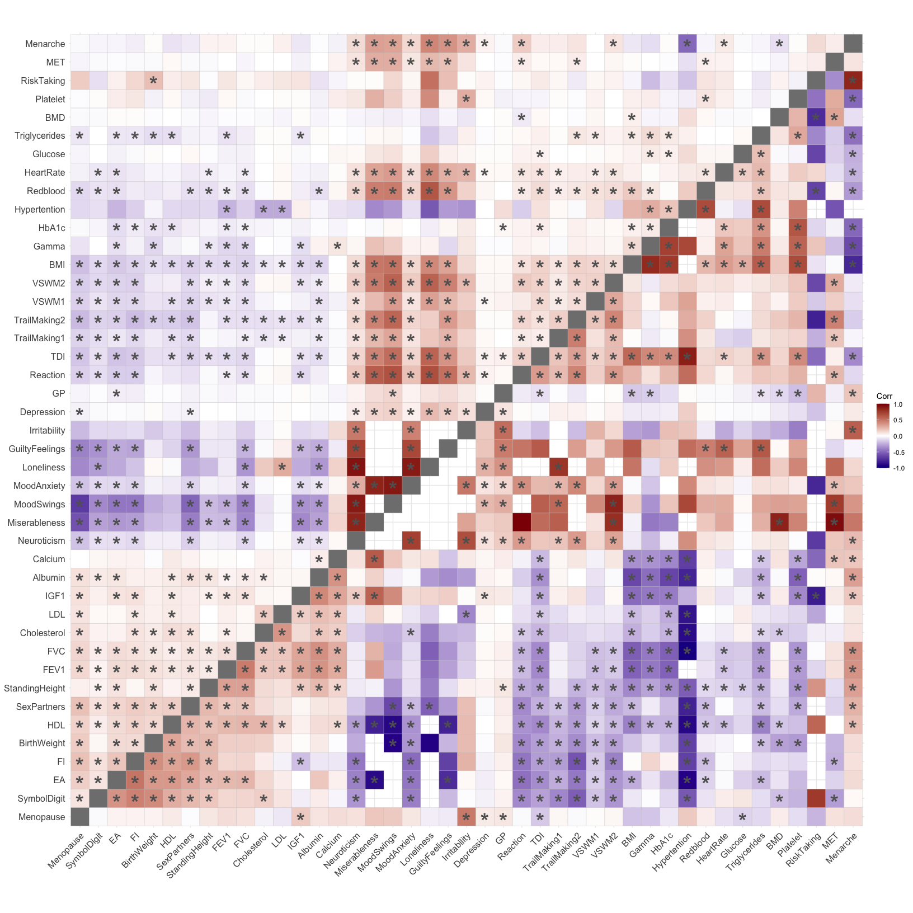
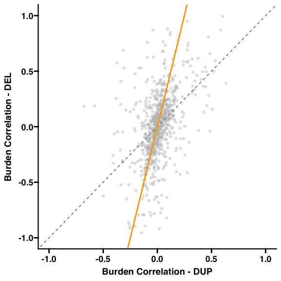
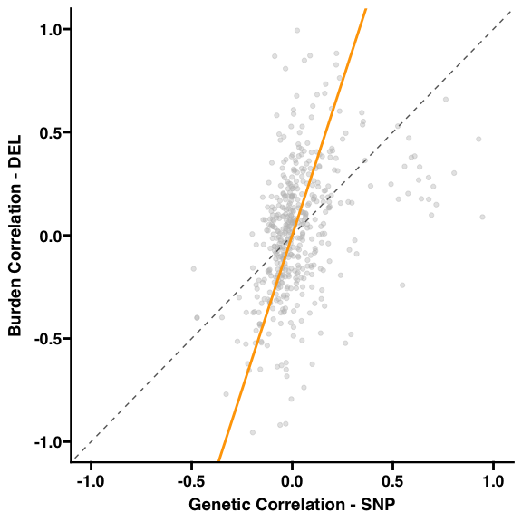
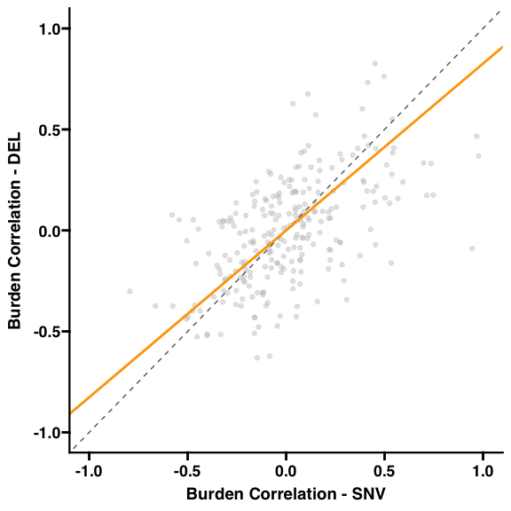

Fig4
================
Sayeh Kazem
2025-08-20

## Fig4 : Rare and common variant architectures across complex traits

## +(S20, S21, ST11)

#### – Figure legend –

A)Example of genetic and phenotypic correlations between fluid
intelligence (FI) and 6 traits, with each point color-coded by
correlation type: SNP-based genetic correlations, deletion, duplication
burden correlations, loss-of-function SNV burden correlation, and
phenotypic correlations. B) The heatmap of burden correlations, for
deletions and duplications in the lower and upper triangle matrices,
respectively. Significant correlations are marked by asterisks (FDR
corrected p-Jaccard). C) The scatter plot compares effect size
correlations between deletions and duplications, where orange lines
represent the Total Least Squares regression. The dashed line indicates
perfect concordance (y = x). We provide the same comparison between CNVs
and (D) SNP-based genetic correlations and (E) SNV burden correlations;
phenotypic correlations are shown in Figure S20. F) Boxplots illustrate
the variance explained by gene sets for both brain and non-brain traits,
based on regression analysis. Abbreviations: BMI: body mass index; EA:
educational attainment; FI: fluid intelligence; TDI: townsend
deprivation index; VSWM: visuospatial working memory; FVC: Forced vital
capacity; Del: deletion; Dup: duplication; SNP: single nucleotide
polymorphism; SNV: single nucleotide variants; LoF: loss of function.

#### Libraries

``` r
#### Libraries for  corr Matrix, stats computation 
library(ggplot2)
library(ggcorrplot)
library(ggprism)
library(ggpubr)
library(dplyr)
```

    ## 
    ## Attaching package: 'dplyr'

    ## The following objects are masked from 'package:stats':
    ## 
    ##     filter, lag

    ## The following objects are masked from 'package:base':
    ## 
    ##     intersect, setdiff, setequal, union

``` r
library(reshape2)
library(Rmpfr)
```

    ## Loading required package: gmp

    ## 
    ## Attaching package: 'gmp'

    ## The following objects are masked from 'package:base':
    ## 
    ##     %*%, apply, crossprod, matrix, tcrossprod

    ## C code of R package 'Rmpfr': GMP using 64 bits per limb

    ## 
    ## Attaching package: 'Rmpfr'

    ## The following object is masked from 'package:gmp':
    ## 
    ##     outer

    ## The following objects are masked from 'package:stats':
    ## 
    ##     dbinom, dgamma, dnbinom, dnorm, dpois, dt, pnorm

    ## The following objects are masked from 'package:base':
    ## 
    ##     cbind, pmax, pmin, rbind

``` r
library(MASS)
```

    ## 
    ## Attaching package: 'MASS'

    ## The following object is masked from 'package:dplyr':
    ## 
    ##     select

``` r
library(vegan)
```

    ## Loading required package: permute

    ## Loading required package: lattice

``` r
library(DescTools)
library(missForest)
library(glue)
library(scales)
library(forcats)
library(readr)
```

    ## 
    ## Attaching package: 'readr'

    ## The following object is masked from 'package:scales':
    ## 
    ##     col_factor

``` r
library(tidyverse)
```

    ## ── Attaching core tidyverse packages ──────────────────────── tidyverse 2.0.0 ──
    ## ✔ lubridate 1.9.4     ✔ tibble    3.2.1
    ## ✔ purrr     1.0.2     ✔ tidyr     1.3.1
    ## ✔ stringr   1.5.1

    ## ── Conflicts ────────────────────────────────────────── tidyverse_conflicts() ──
    ## ✖ readr::col_factor() masks scales::col_factor()
    ## ✖ purrr::discard()    masks scales::discard()
    ## ✖ dplyr::filter()     masks stats::filter()
    ## ✖ dplyr::lag()        masks stats::lag()
    ## ✖ MASS::select()      masks dplyr::select()
    ## ℹ Use the conflicted package (<http://conflicted.r-lib.org/>) to force all conflicts to become errors

``` r
library(RColorBrewer)
```

#### Functions

``` r
# TLS Function ##############################
# Total Least Squares function
total_least_squares <- function(X, Y) {
  X <- as.matrix(X)
  Y <- as.matrix(Y)
  Z <- cbind(X, Y)
  svd_result <- svd(Z)
  U <- svd_result$u
  S <- svd_result$d
  V <- svd_result$v
  nx <- ncol(X)
  Vxy <- V[1:nx, (nx + 1):ncol(V)]
  Vyy <- V[(nx + 1):ncol(V), (nx + 1):ncol(V)]
  B_tls <- -Vxy %*% solve(Vyy)
  return(B_tls)
}


compute_tls_p_value <- function(X, Y, slope) {
  n <- length(X)
  if (n <= 2) {
    stop("Not enough data points to compute p-value.")
  }
  
  mean_x <- mean(X)
  mean_y <- mean(Y)
  s_xx <- sum((X - mean_x)^2)
  s_yy <- sum((Y - mean_y)^2)
  s_xy <- sum((X - mean_x) * (Y - mean_y))
  
  if (s_xx == 0 || s_yy == 0) {
    stop("Variance of X or Y is zero.")
  }
  
  std_err <- sqrt((s_yy - slope * s_xy) / (n - 2)) / sqrt(s_xx)
  t_statistic <- slope / std_err
  
  # Use Rmpfr for higher precision t-statistic
  t_statistic_mpfr <- mpfr(t_statistic, precBits = 256)
  
  # Calculate the p-value manually using the CDF of the t-distribution
  df <- n - 2
  p_value <- 2 * (1 - as.numeric(pf(as.numeric(t_statistic_mpfr)^2, df1 = 1, df2 = df)))
  
  return(list(t_statistic=round(t_statistic_mpfr,2),p_value=round(p_value,2)))
}


#########################################################

#### Sign Concordance function
sign_concordance <- function(df, col1, col2) {
  pos_pos <- sum(df[[col1]] > 0 & df[[col2]] > 0)
  neg_neg <- sum(df[[col1]] < 0 & df[[col2]] < 0)
  neg_pos <- sum(df[[col1]] < 0 & df[[col2]] > 0)
  pos_neg <- sum(df[[col1]] > 0 & df[[col2]] < 0)
  
  count_quadrant <- c(Pos_Pos = pos_pos,
                      Neg_Neg = neg_neg,
                      Neg_Pos = neg_pos,
                      Pos_Neg = pos_neg)
  
  percent_quadrant <- 100 * count_quadrant / nrow(df)
  
  return(list(count = count_quadrant, percent = percent_quadrant))
}

#### Mantel test ###

# Convert long-form data to symmetric matrix
#### Mantel test ###

long_to_matrix <- function(data, col_value, traits = NULL) {
  if (is.null(traits)) {
    traits <- union(data$Trait1, data$Trait2)
  }
  
  # Create tr1/tr2/value columns
  full_data <- data %>%
    dplyr::mutate(
      tr1 = Trait1,
      tr2 = Trait2,
      value = .[[col_value]]
    ) %>%
    dplyr::select(tr1, tr2, value)
  
  # Make symmetric
  full_symmetric <- bind_rows(
    full_data,
    full_data %>% dplyr::rename(tr1 = tr2, tr2 = tr1)
  )
  
  # Add diagonal
  diag_data <- tibble(tr1 = traits, tr2 = traits, value = 1)
  full_symmetric <- bind_rows(full_symmetric, diag_data)
  
  # Pivot to matrix
  mat <- full_symmetric %>%
    pivot_wider(names_from = tr2, values_from = value) %>%
    column_to_rownames("tr1") %>%
    as.matrix()
  
  # Ensure ordering of rows/columns
  return(mat[traits, traits])
}

Mantel_Test <- function(df, var1, var2, permutations = 999) {
  traits <- union(df$Trait1, df$Trait2)
  
  mat1 <- long_to_matrix(df, var1, traits)
  mat2 <- long_to_matrix(df, var2, traits)
  
  dist1 <- as.dist(sqrt(2 * (1 - mat1)))
  dist2 <- as.dist(sqrt(2 * (1 - mat2)))
  
  result <- mantel(dist1, dist2, permutations = permutations, na.rm = TRUE)
  return(result)
}
```

#### Pairwise Genetic Correlations + FDR pvalues (Del,Dup,SNV,SNP)

``` r
load('ST7.RData')
print(ST7[1:3,])
```

    ##    Trait1      Trait2               Pairs    Corr_DEL    Corr_DUP
    ## 1 Albumin BirthWeight Albumin_BirthWeight  0.07360608  0.05449104
    ## 2 Albumin         BMD         Albumin_BMD -0.02088934 -0.02952177
    ## 3 Albumin         BMI         Albumin_BMI -0.62257505 -0.12814343
    ##   Corr_Raw_JaccardPval_DEL Corr_Raw_JaccardPval_DUP Corr_FDR_JaccardPval_DEL
    ## 1                    0.486                    0.072                0.5994757
    ## 2                    0.796                    0.088                0.8729561
    ## 3                    0.001                    0.001                0.0010000
    ##   Corr_FDR_JaccardPval_DUP Corr_SNP    Corr_SNV  Corr_Pheno
    ## 1                0.1398403  -0.0082 -0.20428280  0.01118601
    ## 2                0.1640242  -0.0226  0.05546656  0.02896761
    ## 3                0.0010000  -0.2207 -0.08386970 -0.11916165
    ##   Include_In_DEL_DUP_Corr Include_In_SNP_DEL_Corr Include_In_SNP_DUP_Corr
    ## 1                       1                       1                       1
    ## 2                       1                       1                       1
    ## 3                       1                       1                       1
    ##   Include_In_SNV_DEL_Corr Include_In_SNV_DUP_Corr Include_In_SNP_SNV_Corr
    ## 1                       1                       1                       1
    ## 2                       1                       1                       1
    ## 3                       1                       1                       1

#### The heatmap of burden correlations, for deletions and duplications

``` r
################# Del-Dup Heatmap Matrix ###################
#ST7

# Matrix format of Corr df
Corr_DelDup=subset(ST7,select=c('Trait1','Trait2','Corr_DEL','Corr_DUP','Corr_FDR_JaccardPval_DEL', 'Corr_FDR_JaccardPval_DUP'))

# Get all unique traits
traits <- unique(c(Corr_DelDup$Trait1, Corr_DelDup$Trait2))

# Initialize empty symmetric matrix
Corr_Del_matrix <- matrix(NA, nrow = length(traits), ncol = length(traits),
                          dimnames = list(traits, traits))
# Fill in the matrix
for(i in 1:nrow(Corr_DelDup)){
  t1 <- Corr_DelDup$Trait1[i]
  t2 <- Corr_DelDup$Trait2[i]
  Corr_Del_matrix[t1, t2] <- Corr_DelDup$Corr_DEL[i]
  Corr_Del_matrix[t2, t1] <- Corr_DelDup$Corr_DEL[i]  # symmetric
}

Corr_Dup_matrix <- matrix(NA, nrow = length(traits), ncol = length(traits),
                          dimnames = list(traits, traits))
# Fill in the matrix
for(i in 1:nrow(Corr_DelDup)){
  t1 <- Corr_DelDup$Trait1[i]
  t2 <- Corr_DelDup$Trait2[i]
  Corr_Dup_matrix[t1, t2] <- Corr_DelDup$Corr_DUP[i]
  Corr_Dup_matrix[t2, t1] <- Corr_DelDup$Corr_DUP[i]  # symmetric
}

## Ordering ####
DEL_DUP_Corr_Order= c("Menopause", "SymbolDigit","EA", "FI", "BirthWeight", 
                      "HDL", "SexPartners", "StandingHeight", "FEV1", "FVC", 
                      "Cholesterol", "LDL", "IGF1", "Albumin", "Calcium", "Neuroticism", 
                      "Miserableness", "MoodSwings", "MoodAnxiety", "Loneliness", 
                      "GuiltyFeelings", "Irritability", "Depression", 
                      "GP", "Reaction", "TDI", "TrailMaking1", 
                      "TrailMaking2", "VSWM1", "VSWM2", "BMI", "Gamma", 
                      "HbA1c", "Hypertention", "Redblood", "HeartRate", "Glucose", 
                      "Triglycerides", "BMD", "Platelet", "RiskTaking", "MET", "Menarche")

#### Correlations Ordering #####
#Order of full Matrix ##
Corr_Del_matrix=Corr_Del_matrix[DEL_DUP_Corr_Order,DEL_DUP_Corr_Order]
Corr_Dup_matrix=Corr_Dup_matrix[DEL_DUP_Corr_Order,DEL_DUP_Corr_Order]

combined_corr <- Corr_Del_matrix
combined_corr[upper.tri(combined_corr)] <- Corr_Dup_matrix[upper.tri(Corr_Dup_matrix)]
diag(combined_corr)=Inf
combined_corr_ordered=combined_corr

#################################

## Corr Pvalues ###
# Initialize empty symmetric matrix
CorrPval_Del_matrix <- matrix(NA, nrow = length(traits), ncol = length(traits),
                          dimnames = list(traits, traits))
# Fill in the matrix
for(i in 1:nrow(Corr_DelDup)){
  t1 <- Corr_DelDup$Trait1[i]
  t2 <- Corr_DelDup$Trait2[i]
  CorrPval_Del_matrix[t1, t2] <- Corr_DelDup$Corr_FDR_JaccardPval_DEL[i]
  CorrPval_Del_matrix[t2, t1] <- Corr_DelDup$Corr_FDR_JaccardPval_DEL[i]  # symmetric
}

CorrPval_Dup_matrix <- matrix(NA, nrow = length(traits), ncol = length(traits),
                          dimnames = list(traits, traits))
# Fill in the matrix
for(i in 1:nrow(Corr_DelDup)){
  t1 <- Corr_DelDup$Trait1[i]
  t2 <- Corr_DelDup$Trait2[i]
  CorrPval_Dup_matrix[t1, t2] <- Corr_DelDup$Corr_FDR_JaccardPval_DUP[i]
  CorrPval_Dup_matrix[t2, t1] <- Corr_DelDup$Corr_FDR_JaccardPval_DUP[i]  # symmetric
}
#Preprocessing
CorrPval_Del_matrix <- CorrPval_Del_matrix[DEL_DUP_Corr_Order, DEL_DUP_Corr_Order]
CorrPval_Dup_matrix <- CorrPval_Dup_matrix[DEL_DUP_Corr_Order, DEL_DUP_Corr_Order]

####
combined_corr_Jacpvals_ordered <- CorrPval_Del_matrix
combined_corr_Jacpvals_ordered[upper.tri(combined_corr_Jacpvals_ordered)] <- CorrPval_Dup_matrix[upper.tri(CorrPval_Dup_matrix)]
diag(combined_corr_Jacpvals_ordered)=Inf
 
# Convert p-values to stars manually
significance_levels <- function(p) {
  ifelse(p < 0.05, "*", "")
}

stars_matrix <- matrix(significance_levels(combined_corr_Jacpvals_ordered), 
                       nrow = nrow(combined_corr_Jacpvals_ordered))
rownames(stars_matrix) <- rownames(combined_corr_Jacpvals_ordered)
colnames(stars_matrix) <- colnames(combined_corr_Jacpvals_ordered)

################################## 
##### Heatmap Matrix #####

p <- ggcorrplot(combined_corr_ordered, 
                type = "full", 
                colors = c("darkblue", "white", "darkred"),
                show.diag = TRUE)
# 2) Overlay stars, only where correlation is not NA
for (i in 1:nrow(combined_corr_ordered)) {
  for (j in 1:ncol(combined_corr_ordered)) {
    if (!is.na(combined_corr_ordered[i, j]) && stars_matrix[i, j] != "") {
      p <- p + annotate("text", x = i, y = j - 0.2, label = stars_matrix[i, j], 
                        color = "grey38", size = 10, fontface = "bold")
    }
  }
}

print(p)
```

<!-- -->

#### The scatter plot of burden correlations, for deletions and duplications + Stats

``` r
################# Del-Dup Stats ###################
#A)Regression Slope (TLS) + Plots B) Directionality Test C) Mantel Test D) CCC  (ST11) #########
#ST7
### Subset of trait pairs used for computing Del-Dup Correlations
Corr_DelDup <- ST7 %>% filter(Include_In_DEL_DUP_Corr == 1)
Corr_DelDup=subset(Corr_DelDup,select=c('Trait1','Trait2','Corr_DEL','Corr_DUP','Corr_FDR_JaccardPval_DEL', 'Corr_FDR_JaccardPval_DUP'))
Corr_DelDup = Corr_DelDup[complete.cases(Corr_DelDup[,c('Corr_DEL','Corr_DUP')]),]
################

#A)
Y <- Corr_DelDup$Corr_DEL
X <- Corr_DelDup$Corr_DUP
tls_slope <- total_least_squares(X, Y)
#compute_tls_p_value(X,Y,tls_slope)


### ScatterPlot #################

ggplot(Corr_DelDup, aes(x =Corr_DUP , y =  Corr_DEL)) + 
  geom_point(color = "grey",alpha=0.4) +
  labs(
    x = "Burden Correlation - DUP",
    y = "Burden Correlation - DEL"
  )+
  geom_abline(slope = 1, intercept = 0, linetype = "dashed", color = "grey40") +
  geom_abline(slope = tls_slope, intercept = 0, color = "orange",size=1) + # TLS line
  coord_cartesian(ylim = c(-1, +1), xlim = c(-1, +1)) +
  theme_prism(border = FALSE,base_size = 14,
              base_family = "sans",
              base_fontface = "bold") +
  theme(axis.line = element_line(linewidth = 0.8))     # Change size of y-axis labels
```

    ## Warning: Using `size` aesthetic for lines was deprecated in ggplot2 3.4.0.
    ## ℹ Please use `linewidth` instead.
    ## This warning is displayed once every 8 hours.
    ## Call `lifecycle::last_lifecycle_warnings()` to see where this warning was
    ## generated.

<!-- -->

``` r
paste0("DEL-DUP TLS :",round(tls_slope,2))
```

    ## [1] "DEL-DUP TLS :4.01"

``` r
###############

#B)
result <- sign_concordance(Corr_DelDup, "Corr_DEL", "Corr_DUP")
#result$count     # Concordance counts
result$percent   # Concordance percentages
```

    ##  Pos_Pos  Neg_Neg  Neg_Pos  Pos_Neg 
    ## 37.06897 32.26601 15.27094 15.39409

``` r
#
#C) 
ccc_result <- CCC(Corr_DelDup$Corr_DEL, Corr_DelDup$Corr_DUP)
ccc_result$rho.c
```

    ##         est    lwr.ci    upr.ci
    ## 1 0.3433787 0.2988442 0.3864209

``` r
ccc_result$C.b
```

    ## [1] 0.7594048

``` r
#D) 
mantel_result <- Mantel_Test(Corr_DelDup, "Corr_DEL","Corr_DUP" , permutations = 999)
print(mantel_result)
```

    ## 
    ## Mantel statistic based on Pearson's product-moment correlation 
    ## 
    ## Call:
    ## mantel(xdis = dist1, ydis = dist2, permutations = permutations,      na.rm = TRUE) 
    ## 
    ## Mantel statistic r: 0.4722 
    ##       Significance: 0.001 
    ## 
    ## Upper quantiles of permutations (null model):
    ##    90%    95%  97.5%    99% 
    ## 0.0527 0.0707 0.0856 0.0985 
    ## Permutation: free
    ## Number of permutations: 999

#### Pairwise Genetic Correlations Comparsions: FunBurd correlations (Deletion and Duplication Burden Corr) with Previous Studies (SNV-burden and SNP Genetic Correlations) + TLS slope

``` r
### Subset of trait pairs used for computing CNV-SNP Correlations
Corr_CNVSNP <- ST7 %>% filter(Include_In_SNP_DEL_Corr == 1 & Include_In_SNP_DUP_Corr == 1)
Corr_CNVSNP=subset(Corr_CNVSNP,select=c('Trait1','Trait2','Corr_DEL','Corr_DUP','Corr_SNP'))
Corr_CNVSNP = Corr_CNVSNP[complete.cases(Corr_CNVSNP[,c('Corr_DEL','Corr_SNP','Corr_DUP')]),]

################
## Del-SNP ########
#A)
Y <- Corr_CNVSNP$Corr_DEL
X <- Corr_CNVSNP$Corr_SNP
tls_slope <- total_least_squares(X, Y)
#compute_tls_p_value(X,Y,tls_slope)

### ScatterPlot #################

ggplot(Corr_CNVSNP, aes(x =Corr_SNP , y =  Corr_DEL)) + 
  geom_point(color = "grey",alpha=0.4) +
  labs(
    x = "Genetic Correlation - SNP",
    y = "Burden Correlation - DEL"
  )+
  geom_abline(slope = 1, intercept = 0, linetype = "dashed", color = "grey40") +
  geom_abline(slope = tls_slope, intercept = 0, color = "orange",size=1) + # TLS line
  coord_cartesian(ylim = c(-1, +1), xlim = c(-1, +1)) +
  theme_prism(border = FALSE,base_size = 14,
              base_family = "sans",
              base_fontface = "bold") +
  theme(axis.line = element_line(linewidth = 0.8))
```

<!-- -->

``` r
paste0("SNP-DEL TLS :",round(tls_slope,2))
```

    ## [1] "SNP-DEL TLS :3"

``` r
###############################################
## Dup-SNP ########

#A)
Y <- Corr_CNVSNP$Corr_DUP
X <- Corr_CNVSNP$Corr_SNP
tls_slope <- total_least_squares(X, Y)
#compute_tls_p_value(X,Y,tls_slope)


### ScatterPlot #################

ggplot(Corr_CNVSNP, aes(x =Corr_SNP , y =  Corr_DUP)) + 
  geom_point(color = "grey",alpha=0.4) +
  labs(
    x = "Genetic Correlation - SNP",
    y = "Burden Correlation - DUP"
  )+
  geom_abline(slope = 1, intercept = 0, linetype = "dashed", color = "grey40") +
  geom_abline(slope = tls_slope, intercept = 0, color = "orange",size=1) + # TLS line
  coord_cartesian(ylim = c(-1, +1), xlim = c(-1, +1)) +
  theme_prism(border = FALSE,base_size = 14,
              base_family = "sans",
              base_fontface = "bold") +
  theme(axis.line = element_line(linewidth = 0.8))
```

<!-- -->

``` r
paste0("SNP-DUP TLS :",round(tls_slope,2))
```

    ## [1] "SNP-DUP TLS :0.66"

``` r
### Subset of trait pairs used for computing CNV-SNV Correlations
Corr_CNVSNV <- ST7 %>% filter(Include_In_SNV_DEL_Corr == 1 & Include_In_SNV_DUP_Corr == 1)
Corr_CNVSNV=subset(Corr_CNVSNV,select=c('Trait1','Trait2','Corr_DEL','Corr_DUP','Corr_SNV'))
Corr_CNVSNV = Corr_CNVSNV[complete.cases(Corr_CNVSNV[,c('Corr_DEL','Corr_SNV','Corr_DUP')]),]

################
## Del-SNV ########
#A)
Y <- Corr_CNVSNV$Corr_DEL
X <- Corr_CNVSNV$Corr_SNV
tls_slope <- total_least_squares(X, Y)
#compute_tls_p_value(X,Y,tls_slope)


### ScatterPlot #################

ggplot(Corr_CNVSNV, aes(x =Corr_SNV , y =  Corr_DEL)) + 
  geom_point(color = "grey",alpha=0.4) +
  labs(
    x = "Burden Correlation - SNV",
    y = "Burden Correlation - DEL"
  )+
  geom_abline(slope = 1, intercept = 0, linetype = "dashed", color = "grey40") +
  geom_abline(slope = tls_slope, intercept = 0, color = "orange",size=1) + # TLS line
  coord_cartesian(ylim = c(-1, +1), xlim = c(-1, +1)) +
  theme_prism(border = FALSE,base_size = 14,
              base_family = "sans",
              base_fontface = "bold") +
  theme(axis.line = element_line(linewidth = 0.8))
```

<!-- -->

``` r
paste0("SNV-DEL TLS :",round(tls_slope,3))
```

    ## [1] "SNV-DEL TLS :0.826"

``` r
###############################################
## Dup-SNV ########

#A)
Y <- Corr_CNVSNV$Corr_DUP
X <- Corr_CNVSNV$Corr_SNV
tls_slope <- total_least_squares(X, Y)
#compute_tls_p_value(X,Y,tls_slope)


### ScatterPlot #################

ggplot(Corr_CNVSNV, aes(x =Corr_SNV , y =  Corr_DUP)) + 
  geom_point(color = "grey",alpha=0.4) +
  labs(
    x = "Burden Correlation - SNV",
    y = "Burden Correlation - DUP"
  )+
  geom_abline(slope = 1, intercept = 0, linetype = "dashed", color = "grey40") +
  geom_abline(slope = tls_slope, intercept = 0, color = "orange",size=1) + # TLS line
  coord_cartesian(ylim = c(-1, +1), xlim = c(-1, +1)) +
  theme_prism(border = FALSE,base_size = 14,
              base_family = "sans",
              base_fontface = "bold") +
  theme(axis.line = element_line(linewidth = 0.8))
```

<!-- -->

``` r
paste0("SNV-DUP TLS :",round(tls_slope,2))
```

    ## [1] "SNV-DUP TLS :0.15"

##### All the stats are provided in ST11.

#### Example of FI for genetic correlations comparisons

``` r
# Step 1: Filter rows where Trait1 or Trait2 is FI
FI_rows <- ST7[ST7$Trait1 == "FI" | ST7$Trait2 == "FI", ]
# Step 2: Define the required columns
include_cols <- c(
  "Include_In_DEL_DUP_Corr", 
  "Include_In_SNP_DEL_Corr", 
  "Include_In_SNP_DUP_Corr", 
  "Include_In_SNV_DEL_Corr", 
  "Include_In_SNV_DUP_Corr", 
  "Include_In_SNP_SNV_Corr"
)

# Step 3: Keep only rows where all six columns are equal to 1
FI_rows_all1 <- FI_rows[rowSums(FI_rows[, include_cols] == 1, na.rm = TRUE) == length(include_cols), ]
FI_rows_all1=subset(FI_rows_all1,select=c(Pairs,Trait1,Trait2,Corr_Pheno,Corr_DEL,Corr_DUP,Corr_SNP,Corr_SNV))
# Step 4: Extract the non-FI trait from Trait1 or Trait2
FI_related_traits <- unique(
  ifelse(FI_rows_all1$Trait1 == "FI", FI_rows_all1$Trait2, FI_rows_all1$Trait1)
)


# Reshape the data to long format
FI_With_Others <- FI_rows_all1 %>%
  pivot_longer(cols = c(Corr_DEL,Corr_DUP, Corr_SNV, Corr_Pheno, Corr_SNP),
               names_to = "correlation_type",
               values_to = "correlation") %>%
  mutate(correlation_type = case_when(
    correlation_type == "Corr_DEL" ~ "DEL-burden",
    correlation_type == "Corr_DUP" ~ "DUP-burden",
    correlation_type == "Corr_SNV" ~ "SNV-lof-burden",
    correlation_type == "Corr_SNP" ~ "SNP (rg)",
    correlation_type == "Corr_Pheno" ~ "Phenotype",
    TRUE ~ correlation_type
  ))

# Display the reshaped data
print(FI_With_Others)
```

    ## # A tibble: 105 × 5
    ##    Pairs          Trait1      Trait2 correlation_type correlation
    ##    <chr>          <chr>       <chr>  <chr>                  <dbl>
    ##  1 Albumin_FI     Albumin     FI     DEL-burden           -0.0696
    ##  2 Albumin_FI     Albumin     FI     DUP-burden            0.0538
    ##  3 Albumin_FI     Albumin     FI     SNV-lof-burden        0.138 
    ##  4 Albumin_FI     Albumin     FI     Phenotype             0.0297
    ##  5 Albumin_FI     Albumin     FI     SNP (rg)              0.0336
    ##  6 BirthWeight_FI BirthWeight FI     DEL-burden            0.405 
    ##  7 BirthWeight_FI BirthWeight FI     DUP-burden            0.117 
    ##  8 BirthWeight_FI BirthWeight FI     SNV-lof-burden        0.456 
    ##  9 BirthWeight_FI BirthWeight FI     Phenotype             0.0586
    ## 10 BirthWeight_FI BirthWeight FI     SNP (rg)              0.122 
    ## # ℹ 95 more rows

``` r
FI_Others_plot=FI_With_Others

traits_of_interest <- c("Reaction Time", "Neuroticism", "TDI", "Redblood", "BMI", "StandingHeight")

FI_Others_plot <- subset(FI_Others_plot,
                         Trait1 %in% traits_of_interest | Trait2 %in% traits_of_interest)

FI_Others_plot <- FI_Others_plot %>%
  mutate(Other_Trait = ifelse(Trait1 == "FI", Trait2, Trait1))

FI_Others_plot$Other_Trait <- factor(FI_Others_plot$Other_Trait,
                                     levels = traits_of_interest)

# Desired order of correlation types
FI_Others_plot$correlation_type <- factor(FI_Others_plot$correlation_type,
                                          levels = c("Phenotype", "DUP-burden", "SNP (rg)", "DEL-burden", "SNV-lof-burden"))
### Plot
#colors <- brewer.pal(n = length(unique(FI_Others_plot$correlation_type)), name = "Set2")
custom_colors <- c(
  "DEL-burden" = "red3", 
  "DUP-burden" = "royalblue",# Set to your preferred colors
  "SNV-lof-burden" = "orange3",
  "SNP (rg)" = "green4",
  "Phenotype" = "purple4"
)
colors <- custom_colors[unique(FI_Others_plot$correlation_type)]

# Plot
ggplot(FI_Others_plot, aes(x=correlation, y=Other_Trait, color=correlation_type)) +
  geom_errorbarh(aes(xmin = 0, xmax = correlation),
                 position = position_dodge(width = 0.5),height = 0,alpha=0.7) +
  geom_point(size=2,aes(x=correlation, y=Other_Trait, color=correlation_type),
             position = position_dodge(width = 0.5),alpha=0.8) +
  geom_vline(lty = 2, xintercept = 0,color='darkgrey') +
  #scale_x_continuous(labels = scales::percent_format()) +
  #scale_color_manual(values=rainbow(4)) + 
  scale_color_manual(values=colors)+# Adjust colors for correlation_type
  #scale_size_continuous(labels = scales::comma) +
  
  labs(x = "Correlation with FI",
       y = "",
       color = "Correlation Type")+
  #size = "Correlation Value") +
  #theme_light() 
  theme_prism()+
  #coord_flip() +
  theme(
    panel.grid.major.y = element_blank(),
    panel.border = element_blank(),
    axis.ticks.y = element_blank(),
    axis.text.y = element_text(size = 12),axis.line = element_line(linewidth = 0.8)) 
```

<!-- -->

#### Variance Explained

``` r
# Varinace Explained ##
load('ST6.RData')
ST6[1:4,1:3]
```

    ##         Trait Trait_Cat Del_VarianceExplained
    ## 1     Albumin  NonBrain            0.05322260
    ## 2 BirthWeight  NonBrain            0.09176932
    ## 3         BMD  NonBrain            0.08721131
    ## 4         BMI  NonBrain            0.09837494

``` r
### Deletion Variance Explained for Brain & NonBrain Traits######
p1=ggplot(ST6, aes(x = Trait_Cat, y = Del_VarianceExplained ,fill=Trait_Cat)) +
  geom_boxplot(aes(fill = Trait_Cat), outlier.shape = NA, width = 0.5, alpha = 0.82) +
  geom_jitter(
    size = 0.8,
    alpha = 1,
    shape = 21,
    stroke = 0.4,
    position = position_jitterdodge(jitter.width = 0.1, dodge.width = 0.5)) + 
  scale_fill_manual(values = c("Brain" = "orchid4", "NonBrain" = "gold3")) +
  labs(x = "Del", y = "Variance explained, R2\n (%)") +
  theme_prism() +
  theme(
    legend.position = "none",
    axis.text.x = element_text(size = 12, face = "bold"),
    axis.text.y = element_text(size = 12, face = "bold"),
    plot.title = element_text(face = "bold", size = 14),
    strip.text = element_text(face = "bold"), axis.line = element_line(linewidth = 0.8)
  ) +ylim(0,0.2)

### Duplication Variance Explained for Brain & NonBrain Traits ######
p2=ggplot(ST6, aes(x = Trait_Cat, y = Dup_VarianceExplained ,fill=Trait_Cat)) +
  geom_boxplot(aes(fill = Trait_Cat), outlier.shape = NA, width = 0.5, alpha = 0.82) +
  geom_jitter(
    size = 0.8,
    alpha = 1,
    shape = 21,
    stroke = 0.4,
    position = position_jitterdodge(jitter.width = 0.1, dodge.width = 0.5)) + 
  scale_fill_manual(values = c("Brain" = "orchid4", "NonBrain" = "gold3")) +
  labs(x = "Dup", y = "Variance explained, R2\n (%)") +
  theme_prism() +
  theme(
    legend.position = "none",
    axis.text.x = element_text(size = 12, face = "bold"),
    axis.text.y = element_text(size = 12, face = "bold"),
    plot.title = element_text(face = "bold", size = 14),
    strip.text = element_text(face = "bold"), axis.line = element_line(linewidth = 0.8)
  ) +ylim(0,0.2)
ggarrange(p1,p2,width=c(0.5,0.5))
```

    ## Warning in as_grob.default(plot): Cannot convert object of class numeric into a
    ## grob.

<!-- -->
