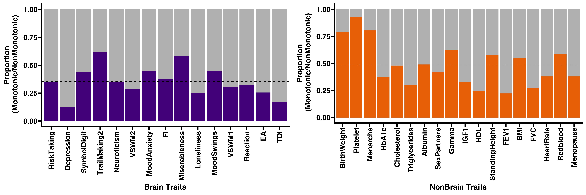
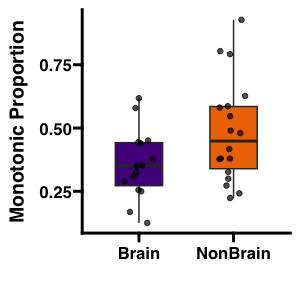
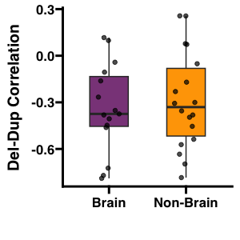

Fig5
================
Sayeh Kazem
2025-08-20

## Fig.5 : Gene dosage responses across traits (+ S22, S23, S24 & ST6).

#### – Figure legend –

A)Illustration of gene dosage responses across 3 brain and non-brain
traits. Each line connects the burden correlations of deletions (left)
and duplications (right) for the same gene set and trait. Dark purple
lines represent monotonic responses (defined as significant effect sizes
with opposing directionality for deletions and duplications) for a given
functional gene set and a given brain trait. Dark orange shows the same
information for non-brain traits. Grey lines represent a non-monotonic
response. Only FDR significant effect sizes (for either deletions or
duplications or both) are represented. Y-axis: effect sizes. B) Summary
of gene dosage responses across traits. The proportions of monotonic and
non-monotonic responses are shown across brain and non-brain traits..
The total number of responses includes only FDR-significant effects (for
either deletions, duplications, or both), and the proportions of
monotonic versus non-monotonic responses are calculated within this
significant subset. C) Box plots depict the distribution of monotonic
responses for brain and non-brain traits; \* indicates statistically
significant (Wilcox Ranksum) differences between groups at the trait
level. D) Proportion of gene dosage responses significant for
deletions-only, duplication-only, and both deletion-duplication, across
brain and non-brain traits. E) Brain and non-brain traits showed similar
levels of deletion-duplication association overlap. F)
Deletion-duplication effect size correlations across traits. The \*
indicates significant correlation (FDR corrected p-Jaccard). G) Brain
and non-brain traits showed similar levels of deletion-duplication
effect size correlations.

#### Libraries

``` r
#### Libraries for Genedosage bar and box plots ###### 
library(ggplot2)
library(ggprism)
library(ggpubr)
library(dplyr)
```

    ## 
    ## Attaching package: 'dplyr'

    ## The following objects are masked from 'package:stats':
    ## 
    ##     filter, lag

    ## The following objects are masked from 'package:base':
    ## 
    ##     intersect, setdiff, setequal, union

``` r
library(reshape2)
library(VennDiagram)
```

    ## Loading required package: grid

    ## Loading required package: futile.logger

    ## 
    ## Attaching package: 'VennDiagram'

    ## The following object is masked from 'package:ggpubr':
    ## 
    ##     rotate

``` r
library(readr)
library(ggridges)
library(viridis)
```

    ## Loading required package: viridisLite

``` r
library(stringr)
library(tidyr)
```

    ## 
    ## Attaching package: 'tidyr'

    ## The following object is masked from 'package:reshape2':
    ## 
    ##     smiths

``` r
library(tidyverse)
```

    ## ── Attaching core tidyverse packages ──────────────────────── tidyverse 2.0.0 ──
    ## ✔ forcats   1.0.0     ✔ purrr     1.0.2
    ## ✔ lubridate 1.9.4     ✔ tibble    3.2.1

    ## ── Conflicts ────────────────────────────────────────── tidyverse_conflicts() ──
    ## ✖ dplyr::filter() masks stats::filter()
    ## ✖ dplyr::lag()    masks stats::lag()
    ## ℹ Use the conflicted package (<http://conflicted.r-lib.org/>) to force all conflicts to become errors

#### Panel A) Examples of gene dosage responses

``` r
##Effectsize Data ##
```

#### Panel B) Gene dosage responses across traits

##### We only considered the traits that have at least 10% of significant associations with genesets (for Del or Dup)

``` r
# Load and prepare data
load('ST6.RData')
GeneDosage_df=ST6[,c("Trait","Trait_Cat",'gene_dosage_responses_proportion_monotonic')]
GeneDosage_df[1:3,]
```

    ##         Trait Trait_Cat gene_dosage_responses_proportion_monotonic
    ## 1     Albumin  NonBrain                                  0.4897959
    ## 2 BirthWeight  NonBrain                                  0.7916667
    ## 3         BMD  NonBrain                                  0.7500000

``` r
# Define trait orders
order_Brain <- c("RiskTaking","Depression","SymbolDigit","TrailMaking2", "Neuroticism","VSWM2",
                 "MoodAnxiety","FI","Miserableness","Loneliness","MoodSwings","VSWM1",
                 "Reaction","EA","TDI")

order_NBrains <- c("BirthWeight","Platelet","Menarche","HbA1c","Cholesterol","Triglycerides",
                   "Albumin","SexPartners","Gamma","IGF1","HDL","StandingHeight","FEV1",
                   "BMI","FVC","HeartRate","Redblood","Menopause")

# Helper function to prepare data
prepare_trait_df <- function(data, trait_list, color) {
  data %>%
    filter(Trait %in% trait_list) %>%
    mutate(
      Trait = factor(Trait, levels = trait_list),
      grey = 1 - gene_dosage_responses_proportion_monotonic,
      concordance = color
    )
}

# Prepare Brain and NonBrain data
Brain_df <- prepare_trait_df(GeneDosage_df, order_Brain, "purple4")
NonBrain_df <- prepare_trait_df(GeneDosage_df, order_NBrains, "darkorange2")

# Melt and assign fill color
prepare_melt_df <- function(df) {
  melt(df, id.vars = c("Trait", "concordance"),
       measure.vars = c("gene_dosage_responses_proportion_monotonic", "grey"),
       value.name = "Proportion") %>%
    mutate(fill_color = ifelse(variable == "grey", "grey", concordance)) %>%
    select(-variable) %>%
    mutate(fill_color = factor(fill_color, levels = c( "grey",concordance[1])))
}

Brain_melt <- prepare_melt_df(Brain_df)
NonBrain_melt <- prepare_melt_df(NonBrain_df)

# Mean lines
mean_brain <- mean(Brain_df$gene_dosage_responses_proportion_monotonic)
mean_nonbrain <- mean(NonBrain_df$gene_dosage_responses_proportion_monotonic)

# Plot function
create_mono_plot <- function(data, mean_val, title, fill_colors) {
  ggplot(data, aes(x = Trait, y = Proportion, fill = fill_color)) +
    geom_bar(stat = "identity", position = "stack") +
    geom_hline(yintercept = mean_val, linetype = "dashed", color = "black", linewidth = 0.5) +
    theme_prism() +
    labs(y = "Proportion\n (Monotonic/NonMonotonic)", x = title) +
    scale_fill_manual(values = fill_colors) +
    theme(axis.text.x = element_text(angle = 90, hjust = 1),
          legend.position = "none")
}

# Create plots
Brain_plot <- create_mono_plot(Brain_melt, mean_brain, "Brain Traits", c("purple4" = "purple4", "grey" = "grey"))
NonBrain_plot <- create_mono_plot(NonBrain_melt, mean_nonbrain, "NonBrain Traits", c("darkorange2" = "darkorange2", "grey" = "grey"))

# Combine plots
ggarrange(Brain_plot, NonBrain_plot, ncol = 2, nrow = 1)
```

<!-- -->

#### Panel C) box-plots & stats

``` r
#-------------------- Monotonicity - Box Plots Brain VS Non-Brain -----------------------#
#Brain_melt
#NonBrain_melt

NBrain_PairedStats_discon=subset(NonBrain_melt,fill_color=='darkorange2')
NBrain_PairedStats_discon$Trait_Cat='NonBrain'
Brain_PairedStats_discon=subset(Brain_melt,fill_color=='purple4')
Brain_PairedStats_discon$Trait_Cat='Brain'
#############
BrainNonBrain_Box_df=rbind(Brain_PairedStats_discon,NBrain_PairedStats_discon)
#shapiro.test(DataTest$Proportion[DataTest$Trait_Cat == "Brain"])
#shapiro.test(DataTest$Proportion[DataTest$Trait_Cat == "Non-Brain"])
t.test(Proportion ~ Trait_Cat, data = BrainNonBrain_Box_df, var.equal = FALSE)
```

    ## 
    ##  Welch Two Sample t-test
    ## 
    ## data:  Proportion by Trait_Cat
    ## t = -2.1968, df = 29.75, p-value = 0.03597
    ## alternative hypothesis: true difference in means between group Brain and group NonBrain is not equal to 0
    ## 95 percent confidence interval:
    ##  -0.252418317 -0.009155726
    ## sample estimates:
    ##    mean in group Brain mean in group NonBrain 
    ##              0.3553141              0.4861011

``` r
#wilcox.test(proportion ~ Trait_Cat, data = DataTest, alternative = "two.sided",exact = FALSE)

Mono_Box=ggplot(BrainNonBrain_Box_df, aes(x = Trait_Cat, y = Proportion, fill = Trait_Cat)) +
  geom_boxplot(outlier.shape = NA, width = 0.5, alpha = 1) +
  geom_jitter(width = 0.15, size = 1.5, alpha = 0.7) +
  scale_fill_manual(values = c("Brain" = "purple4", "NonBrain" = "darkorange2")) +
  #theme_minimal() +
  labs(x = "", y = "Monotonic Proportion" )+
  theme_prism()+
  theme(legend.position = "none",
        #axis.title.y = element_text(size = 14, face = ""),
        axis.text.x = element_text(size = 12, face = "bold"),
        axis.text.y = element_text(size = 12, face = "bold"),
        plot.title = element_text(face = "bold", size = 14),
        strip.text = element_text(face = "bold"))

Mono_Box
```

<!-- -->

#### Panel D) Gene dosage responses functional overlap

``` r
load('ST6.RData')
# ST6
Overlap_df=ST6[,c("Trait","Trait_Cat","proportion_del_dup_bothsig","proportion_del_sig_only", "proportion_dup_sig_only")]
Overlap_df[1:3,]
```

    ##         Trait Trait_Cat proportion_del_dup_bothsig proportion_del_sig_only
    ## 1     Albumin  NonBrain                 0.02040816               0.8367347
    ## 2 BirthWeight  NonBrain                 0.04166667               0.6250000
    ## 3         BMD  NonBrain                 0.00000000               0.8000000
    ##   proportion_dup_sig_only
    ## 1               0.1428571
    ## 2               0.3333333
    ## 3               0.2000000

``` r
# Function to process Brain / Non-Brain data
process_overlap <- function(df, order_vec) {
  df %>%
    filter(Trait %in% order_vec) %>%
    mutate(Trait = factor(Trait, levels = order_vec)) %>%
    arrange(Trait) %>%
    rename(
      Del_Dup = proportion_del_dup_bothsig,
      Del_only = proportion_del_sig_only,
      Dup_only = proportion_dup_sig_only
    ) %>%
    pivot_longer(cols = c(Del_Dup, Del_only, Dup_only),
                 names_to = "Category", values_to = "Percentage") %>%
    mutate(
      Percentage = Percentage * 100,
      Category = factor(Category, levels = c("Dup_only", "Del_Dup", "Del_only"))
    )
}

# Apply function
Overlap_df_Brain  <- process_overlap(Overlap_df, order_Brain)
Overlap_df_NBrain <- process_overlap(Overlap_df, order_NBrains)

# Function to plot
plot_overlap <- function(df) {
  ggplot(df, aes(fill = Category, y = Percentage, x = Trait)) +
    geom_bar(position = "stack", stat = "identity") +
    scale_fill_manual(values = c("Dup_only" = "royalblue",
                                 "Del_Dup" = "grey60",
                                 "Del_only" = "red3")) +
    theme_prism(axis_text_angle = 45) +
    theme(
      legend.position = "none",
      plot.margin = margin(10, 10, 0, 10),
      axis.line.x = element_line(linewidth = 0.8),
      axis.ticks.y = element_blank(),
      axis.title.y = element_blank()
    ) +
    xlab(NULL) + ylab("%") +
    ylim(0, 101) +
    scale_x_discrete(position = "bottom")
}

# Plots
DelDupOverlap_Brain  <- plot_overlap(Overlap_df_Brain)
DelDupOverlap_NBrain <- plot_overlap(Overlap_df_NBrain)

ggarrange(DelDupOverlap_Brain, DelDupOverlap_NBrain, ncol = 2, nrow = 1)
```

<!-- -->

#### Panel E) box-plots & stats

``` r
### Overlap BoxPlot ###############
#-------------------- Overlap Box Plots Brain VS Non-Brain -----------------------#
NBrain_Overlap=subset(Overlap_df_NBrain,Category=='Del_Dup')
Brain_Overlap=subset(Overlap_df_Brain,Category=='Del_Dup')

#############
Overlap_BrainNBrain=rbind(Brain_Overlap,NBrain_Overlap)

#shapiro.test(DataTest$proportion[DataTest$Trait_Cat == "Brain"])
#shapiro.test(DataTest$proportion[DataTest$Trait_Cat == "Non-Brain"])
t.test(Percentage ~ Trait_Cat, data = Overlap_BrainNBrain, var.equal = FALSE)
```

    ## 
    ##  Welch Two Sample t-test
    ## 
    ## data:  Percentage by Trait_Cat
    ## t = 0.72992, df = 30.556, p-value = 0.471
    ## alternative hypothesis: true difference in means between group Brain and group NonBrain is not equal to 0
    ## 95 percent confidence interval:
    ##  -4.236873  8.955473
    ## sample estimates:
    ##    mean in group Brain mean in group NonBrain 
    ##               13.02923               10.66993

``` r
#wilcox.test(proportion ~ Trait_Cat, data = DataTest, alternative = "two.sided",exact = FALSE)

Overlap_Box=ggplot(Overlap_BrainNBrain, aes(x = Trait_Cat, y = Percentage)) +
  geom_boxplot(outlier.shape = NA, width = 0.5, alpha = 1) +
  geom_jitter(width = 0.15, size = 1.7, alpha = 0.6) +
  labs(x = "", y = "Del-Dup Overlap Percentage" )+
  theme_prism()+
  theme(legend.position = "none",
        axis.title.y = element_text(size = 10, face = "bold"),
        axis.text.x = element_text(size = 12, face = "bold"),
        axis.text.y = element_text(size = 12, face = "bold"),
        plot.title = element_text(face = "bold", size = 14),
        strip.text = element_text(face = "bold"))
Overlap_Box
```

<!-- -->

#### Panel F) Del-Dup effectsize Correlations

``` r
# ST6
DelDup_Corr=ST6[,c("Trait","Trait_Cat", "cor_del_dup")]
DelDup_Corr[1:3,]
```

    ##         Trait Trait_Cat cor_del_dup
    ## 1     Albumin  NonBrain  -0.3960618
    ## 2 BirthWeight  NonBrain  -0.7843803
    ## 3         BMD  NonBrain  -0.2048580

``` r
DelDup_Corr_Brain=subset(DelDup_Corr,Trait_Cat=='Brain')
DelDup_Corr_Brain=subset(DelDup_Corr_Brain, Trait%in%order_Brain)
DelDup_Corr_Brain$Trait <- factor(DelDup_Corr_Brain$Trait, levels = order_Brain)

DelDup_Corr_NBrain=subset(DelDup_Corr,Trait_Cat=='NonBrain')
DelDup_Corr_NBrain=subset(DelDup_Corr_NBrain, Trait%in%order_NBrains)
DelDup_Corr_NBrain$Trait <- factor(DelDup_Corr_NBrain$Trait, levels = order_NBrains)

category_colors <- c(
  "Brain" = "orchid4",
  "NonBrain" = "orange")

############
DelDupCorr_Brain = ggplot(DelDup_Corr_Brain, aes(x = Trait, y = cor_del_dup,fill=Trait_Cat)) +
  #geom_col(fill = "grey", color = "black") +
  geom_col(color = "black") +  # Add border color to the bars
  scale_fill_manual(values = category_colors) +  
  geom_hline(yintercept = mean(DelDup_Corr_Brain$cor_del_dup),linetype="dashed",color="black") +
  geom_hline(yintercept = 0, linetype = "solid", color = "black",size = 1) +  # Add the 0 line
  labs(#title = "Bar Plot of Del-Dup Correlation",
    x = "",
    y = "Del-Dup Correlation") +
  
  #scale_y_continuous(labels = number_format(accuracy = 0.01)) + 
  theme_prism(axis_text_angle = 45) +
  theme(legend.position = "none",axis.text.x = element_text(size = 16, angle = 90, vjust = 0.5, hjust = 1),  axis.line = element_line(size = 0.8),      # Change size of y-axis labels
        axis.title.y = element_text(size = 14) )+
  coord_cartesian(ylim = c(-0.8, 0.45)) +
  scale_x_discrete(position = "bottom") 
```

    ## Warning: Using `size` aesthetic for lines was deprecated in ggplot2 3.4.0.
    ## ℹ Please use `linewidth` instead.
    ## This warning is displayed once every 8 hours.
    ## Call `lifecycle::last_lifecycle_warnings()` to see where this warning was
    ## generated.

    ## Warning: The `size` argument of `element_line()` is deprecated as of ggplot2 3.4.0.
    ## ℹ Please use the `linewidth` argument instead.
    ## This warning is displayed once every 8 hours.
    ## Call `lifecycle::last_lifecycle_warnings()` to see where this warning was
    ## generated.

``` r
DelDupCorr_NBrain = ggplot(DelDup_Corr_NBrain, aes(x = Trait, y = cor_del_dup,fill=Trait_Cat)) +
  #geom_col(fill = "grey", color = "black") +
  geom_col(color = "black") +  # Add border color to the bars
  scale_fill_manual(values = category_colors) +  
  geom_hline(yintercept = mean(DelDup_Corr_NBrain$cor_del_dup),linetype="dashed",color="black")+
  geom_hline(yintercept = 0, linetype = "solid", color = "black",size = 1) +  # Add the 0 line
  labs(#title = "Bar Plot of Del-Dup Correlation",
    x = "",
    y = "") +
  #scale_y_continuous(labels = number_format(accuracy = 0.01)) +
  theme_prism(axis_text_angle = 45) +
  #theme(legend.position = "none",legend.text = element_text(size = 16),axis.text.x = element_text(size = 12, angle = 45, vjust = 1, hjust = 1), plot.margin = margin(20, 35, 20, 20))+
  theme(legend.position = "none",axis.text.x = element_text(size = 16, angle = 90, vjust = 0.5, hjust = 1),  axis.line.x = element_line(size = 0.8), axis.line.y = element_blank(),     # Change size of y-axis labels
        #axis.line = element_line(size = 0.8),
        axis.text.y = element_blank(),
        axis.ticks.y = element_blank(),
        axis.title.y = element_blank() 
  )+
  coord_cartesian(ylim = c(-0.8, 0.45)) +
  scale_x_discrete(position = "bottom") 

ggarrange(DelDupCorr_Brain, DelDupCorr_NBrain, ncol = 2, nrow = 1)
```

<!-- -->

#### Jaccard-based pvalue for Del-Dup effectsize correlations (Computed using P-Jaccard python notebook)

``` r
DelDup_PJaccard_fdr=ST6[,c("Trait","Trait_Cat", "adj_JaccardPvalue_cor_del_dup")]
DelDup_PJaccard_fdr <- na.omit(DelDup_PJaccard_fdr)
DelDup_PJaccard_fdr[DelDup_PJaccard_fdr$adj_JaccardPvalue_cor_del_dup < 0.05 , ]
```

    ##           Trait Trait_Cat adj_JaccardPvalue_cor_del_dup
    ## 1       Albumin  NonBrain                    0.03400000
    ## 2   BirthWeight  NonBrain                    0.00000000
    ## 6   Cholesterol  NonBrain                    0.01700000
    ## 7    Depression     Brain                    0.00000000
    ## 10           FI     Brain                    0.02266667
    ## 12        Gamma  NonBrain                    0.04533333
    ## 16        HbA1c  NonBrain                    0.00000000
    ## 24     Menarche  NonBrain                    0.00000000
    ## 29  MoodAnxiety     Brain                    0.03709091
    ## 30  Neuroticism     Brain                    0.03709091
    ## 32     Platelet  NonBrain                    0.00000000
    ## 35   RiskTaking     Brain                    0.00000000
    ## 37  SymbolDigit     Brain                    0.00000000
    ## 40 TrailMaking2     Brain                    0.02266667

#### Panel G) box-plots & stats

``` r
#-------------------- DelDup Correlation Box Plots Brain VS Non-Brain -----------------------#
BrainCor=DelDup_Corr_Brain$cor_del_dup
NBrainCor=DelDup_Corr_NBrain$cor_del_dup
#boxplot(BrainCor, NBrainCor, names = c("Brain", "Non-Brain"), ylab = "Correlation")

BrainNonBrain_Cor <- data.frame(
  Correlation = c(BrainCor, NBrainCor),
  Trait_Cat = c(rep("Brain", length(BrainCor)), rep("Non-Brain", length(NBrainCor)))
)

t.test(Correlation ~ Trait_Cat, data = BrainNonBrain_Cor, var.equal = FALSE)
```

    ## 
    ##  Welch Two Sample t-test
    ## 
    ## data:  Correlation by Trait_Cat
    ## t = -0.46477, df = 30.681, p-value = 0.6454
    ## alternative hypothesis: true difference in means between group Brain and group Non-Brain is not equal to 0
    ## 95 percent confidence interval:
    ##  -0.2614038  0.1644097
    ## sample estimates:
    ##     mean in group Brain mean in group Non-Brain 
    ##              -0.3378549              -0.2893579

``` r
Del_Dup_Box=ggplot(BrainNonBrain_Cor, aes(x = Trait_Cat, y = Correlation, fill = Trait_Cat)) +
  geom_boxplot(outlier.shape = NA, width = 0.5, alpha = 1) +
  geom_jitter(width = 0.15, size = 1.5, alpha = 0.7) +
  scale_fill_manual(values = c("Brain" = "orchid4", "Non-Brain" = "orange")) +
  theme_prism()+
  labs(x = "", y = "Del-Dup Correlation") +
  theme(legend.position = "none",
        axis.title.y = element_text(size = 14, face = "bold"),
        axis.text.x = element_text(size = 12, face = "bold"),
        axis.text.y = element_text(size = 12, face = "bold"),
        plot.title = element_text(face = "bold", size = 14),
        strip.text = element_text(face = "bold"))
Del_Dup_Box
```

<!-- -->

#### Permutation test script for functional overlap (stars in Panel D)

##### This method is used for S23 with the supported results in S23

``` r
### Permutation Test #####
#Part1: Observed Overlap #
### Stats: Permutation Test on Functional Overalp####
Overlap_df=rbind(Overlap_df_Brain,Overlap_df_NBrain)
traits_of_interest=c(order_Brain,order_NBrains)
# Compute observed ratios ---------------------------------------------
ratio_data_DELDUP_Stacked <- Overlap_df %>%
  filter(Category %in% c("Del_only", "Del_Dup", "Dup_only")) %>%
  pivot_wider(names_from = Category, values_from = Percentage) %>%
  mutate(Ratio = Del_Dup / (Del_only + Del_Dup + Dup_only))

# Extract observed ratios in one go
observed_ratios <- ratio_data_DELDUP_Stacked %>%
  filter(Trait %in% traits_of_interest) %>%
  dplyr::select(Trait, Ratio) %>%
  deframe()  # named vector: trait -> ratio


#Part2: Permutating Del and Dup FDRs  #

### FDR_pvalue data from ST2  #####
load('ST2.RData')
DEL_Stacked_fdr=subset(ST2,CNV_Type=='DEL')
DEL_Stacked_fdr=subset(DEL_Stacked_fdr,select=c('Trait','Geneset','FDR_p_value'))

# FDR p-value matrix
DEL_Stacked_fdr <- DEL_Stacked_fdr %>%
  pivot_wider(names_from = Trait, values_from = FDR_p_value) %>%
  column_to_rownames("Geneset")
DEL_Stacked_fdr=DEL_Stacked_fdr[intersect(colnames(DEL_Stacked_fdr), traits_of_interest)]


DUP_Stacked_fdr=subset(ST2,CNV_Type=='DUP')
DUP_Stacked_fdr=subset(DUP_Stacked_fdr,select=c('Trait','Geneset','FDR_p_value'))

# FDR p-value matrix
DUP_Stacked_fdr <- DUP_Stacked_fdr %>%
  pivot_wider(names_from = Trait, values_from = FDR_p_value) %>%
  column_to_rownames("Geneset")
DUP_Stacked_fdr=DUP_Stacked_fdr[intersect(colnames(DUP_Stacked_fdr), traits_of_interest)]

# Initialize permutation results -------------------------------------
n_perm <- 400
# In my analysis I considered 1000 #

perm_results <- matrix(NA, nrow = n_perm, ncol = length(traits_of_interest),
                       dimnames = list(NULL, traits_of_interest))

# Permutation test ---------------------------------------------------
for (i in 1:n_perm) {
  #message("Permutation ", i)
  
  # Shuffle each column in DEL and DUP
  DEL_perm <- DEL_Stacked_fdr %>%
    mutate(across(everything(), ~ sample(.)))
  DUP_perm <- DUP_Stacked_fdr %>%
    mutate(across(everything(), ~ sample(.)))
  
  # Collect results for each trait
  final_result_df <- data.frame(
    Traits = character(), Category = character(),
    Percentage = numeric(), stringsAsFactors = FALSE
  )
  
  for (trait in colnames(DEL_perm)) {
    df <- data.frame(
      RowNames = rownames(DEL_perm),
      Significant_in_Del_only = 0,
      Significant_in_Both     = 0,
      Significant_in_Dup_only = 0,
      Significant_in_None     = 0
    )
    
    for (row in seq_len(nrow(DEL_perm))) {
      val_DEL <- DEL_perm[row, trait]
      val_DUP <- DUP_perm[row, trait]
      
      if (val_DEL < 0.05 & val_DUP < 0.05) {
        df[row, "Significant_in_Both"] <- 1
      } else if (val_DEL < 0.05 & val_DUP >= 0.05) {
        df[row, "Significant_in_Del_only"] <- 1
      } else if (val_DEL >= 0.05 & val_DUP < 0.05) {
        df[row, "Significant_in_Dup_only"] <- 1
      } else {
        df[row, "Significant_in_None"] <- 1
      }
    }
    
    proportions <- round(colMeans(df[, -1]) * 100, 2)
    trait_df <- data.frame(
      Traits = trait,
      Category = names(proportions),
      Percentage = proportions
    )
    final_result_df <- rbind(final_result_df, trait_df)
  }
  
  # Compute ratios for this permutation
  ratio_perm <- final_result_df %>%
    filter(Category %in% c("Significant_in_Del_only",
                           "Significant_in_Both",
                           "Significant_in_Dup_only")) %>%
    pivot_wider(names_from = Category, values_from = Percentage) %>%
    mutate(Ratio = Significant_in_Both /
             (Significant_in_Del_only + Significant_in_Both + Significant_in_Dup_only))
  
  # Store permutation ratios only for traits of interest
  perm_results[i, ] <- ratio_perm %>%
    filter(Traits %in% traits_of_interest) %>%
    arrange(match(Traits, traits_of_interest)) %>%
    pull(Ratio)
}

# Now we have:
# - observed_ratios: vector of observed ratios
# - perm_results: matrix (rows = permutations, cols = traits)

#################################

# Part 3: Extracting p-values  ----------------------------

# make perm_results into tibble
perm_df <- as_tibble(perm_results)

# compute p-values for each trait
p_value_DELDUP_Permutation <- map_dfr(names(perm_df), function(trait) {
  obs <- observed_ratios[[trait]]
  perms <- perm_df[[trait]]
  
  tibble(
    Trait = trait,
    p_value = mean(perms >= obs, na.rm = TRUE)
  )
})

# handle zero p-values (replace with 1 / n_perm)
n_perm <- nrow(perm_results)

p_value_DELDUP_Permutation <- p_value_DELDUP_Permutation %>%
  mutate(
    p_value = ifelse(p_value == 0, 1 / n_perm, p_value),
    FDR_p_value = p.adjust(p_value, method = "fdr"),
    FDR_log_pvalue = -log10(FDR_p_value),
    Trait = factor(Trait, levels = names(observed_ratios)) # keep trait order
  )

# significance line
significance_line <- -log10(0.05)

# plot
Plot_DELDUP <- ggplot(p_value_DELDUP_Permutation, aes(x = Trait, y = FDR_log_pvalue)) +
  geom_point(color = "darkgrey", size = 3) +
  geom_hline(yintercept = significance_line, linetype = "dashed", color = "darkgray", size = 0.75) +
  theme(axis.text.x = element_text(angle = 45, hjust = 0.9, vjust = 0.8, size = 9)) +
  labs(x = NULL, y = "-log10(FDR p-value)") +
  ylim(c(0, 2.5))

Plot_DELDUP
```

<!-- -->
